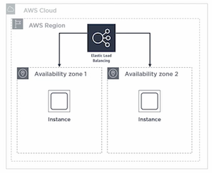
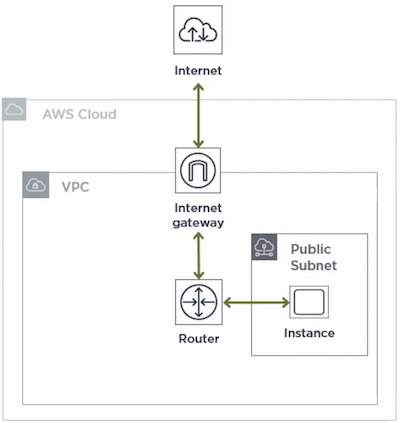
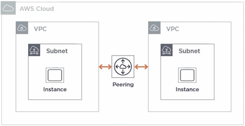

# AWS Basic

## Region

A region is a geographic location spread throughout the world.

A disaster or something in one area of the world will not affect a different area.

By having regions all around the world, there are also some performance benefits in getting the data and services closer to your users.

For general use, choose the region closest to you, however, not all regions have all AWS services available.

The cost of services from one region to another can be different.

## Availability Zone

An availability zone is an isolated set of resources within a region. 

Each region has at least two availability zones. 

The idea is that a fire or power outage in one availability zone should not affect another availability zone.

Each availability zone is also connected via a high-speed network connection.

Go to [AWS Global Infrastructure](https://aws.amazon.com/about-aws/global-infrastructure/) to see the latest information about regions and availability zones in the AWS cloud. 

## Instance Deployment Models

### Single Instance

- A single AWS region and a single availability zone in which you place a single instance.
- Most basic setup
- Single point of failure

Used for:
- Development (not production)
- Proof of concept

### Multiple instances

We have a single region still within the cloud, but instead of a single availability zone we have two. In those, you place one or more instances. 

AWS provides elastic load balancing options to direct traffic to your instances in each availability zone. An elastic load balancer must have at least two instances in two different availability zones in order to send traffic to those instances.

Used for production where region failure is acceptable risk.

### Multiple regions

In this model, you would select two different AWS regions. 

Within each region you would still have at least two availability zones, and within each of those you would have at least one instance. 

Each region would have its own elastic load balancer, then in order to wrap traffic between the regions, you would use Amazon Route 53, which is their DNS service. 

- Most complex
- Highest cost
- Highest level of redundancy

## Virtual Private Cloud (VPC)

You can think of a VPC as a logically isolated piece of the AWS cloud. It's like your own private data center. 

- VPCs belong to a region. 
- A VPC span all availability zones in that region.
- You can have multiple VPCs per region. 
- VPC contain subnets.
- A subnet is tied to a single availability zone. 
- EC2 instances will be launched into a specific subnet. 
- Each region has a default VPC

Availability zones are connected and designed for extremely low latency

## Internal IP Addresses

An IPv4 address range is required for your VPC. This is specified using classless inter-domain routing, or CIDR block

In AWS, the allowed block size is between /16 and /28.

- `10.0.0.0/16` -> 65,536 possible addresses (`10.0.0.0` - `10.0.255.255`)
- `10.0.0.0/28` -> 16 possible addresses (`10.0.0.0` - `10.0.0.15`)

To calculate the first and last IP, as well as the number of available addresses, use [CIDR.xyz](https://cidr.xyz/).

AWS reserves first 4 and last address of each subnet block. For example, `10.0.0.0/20`, 5 reserved addresses:
- `10.0.0.0`
- `10.0.0.1`
- `10.0.0.2`
- `10.0.0.3`
- `10.0.15.255`

Each subnet CIDR block must be a subset of your VPC CIDR, and your subnets cannot overlap.

When instances are launched, their IP address is determined by the subnet CIDR.

## External IP Addresses

- Are not assigned by default. 
- Must specify if you want a public IP on instance creation. 
- External IP address is assigned by AWS. 
- Will change when stop and start instance. Use an elastic IP to keep the same IP address.

## Ingress and Egress Control

- Security groups determine allowed traffic to/from **instances** by port, protocol, source, destination
- Network access control lists (NACL) specify allow/deny rules for traffic in and out of a **subnet**
- VPCs can be peered to allow trafic between VPCs in different **regions**, AWS account
- VPCs can be accessed via a VPN
- Route tables control traffic in/out of **subnets**
- Internet Gateway provide access to external internet
- NAT gateway provide external internet access for **private subnets**

## Design patterns for VPCs

### Internet-accessible VPC

A VPC that has a public subnet, meaning the instances in that subnet have **public IP addresses**. 

To allow instances are accessible via the internet, you'll need to create and attach an **internet gateway** to your VPC. 

You will also define **routes** to tell the router to send external traffic through the internet gateway, and how to route inbound traffic to your instances via their public IP addresses.

You would need to ensure that your **security groups** were set up properly so that you don't expose your instances to unnecessary risk. 

You can also configure allow and deny rules in a **network access control list**, and attach that to the subnet. 

This type of setup is good for:

- proofs of concept
- tests
- development
- some production scenarios where all of your instances need to be public facing

### VPC with public and private subnets

Instances in **public subnet** have full access to the internet via the router and internet gateway.

Instances in your **private subnet** have another layer of protection in that there is no direct route from the internet to access those instances because they have **no public IP address**. They are only assigned an internal IP address based on the CIDR block of the private subnet.

In order to **access these instances**, you'll need to set up a Bastien or a jump box in your public subnet. This is a server that you would log into from the internet to then jump to the instances in your private subnet to be able to work on those. This is accomplished by **setting up a route that allows traffic from the public subnet to enter the private subnet**.

If you need to **access the external public internet** from your private subnet, you'll need to create a NAT gateway and attach it to your subnet. A **NAT gateway** allows requests to be initiated from instances in your private subnet to go out to the internet and receive a response. It does not allow requests from the outside internet to be initiated and reach your instances inside of your private subnet.

For example, **backend database** or application servers that do not need to receive traffic from the public internet can be in your **private subnet**.

### VPC peering

VPC peering allows you to take two different VPCs (same or different accounts) and link them such that they appear to be on the same network.

VPC peering is not transitive. For example, if I have VPCs A and B peered, as well as A and C, B and C cannot communicate directly with each other unless they were also peered.

