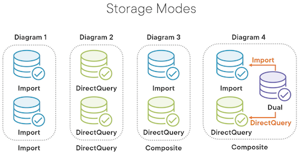
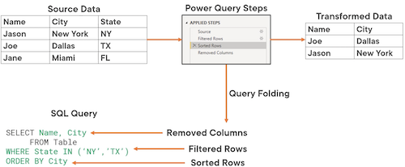

# Gathering Data into Power BI

Regardless of what kind of report you want to create, the starting point will always be to get the data from one or more data sources. 

This import process is done through Power BI connectors.

File connectors: 
- Getting data from Excel spreadsheets, CSV, TXT, JSON, XML, PDF
- You could extract tables from a PDF document
- Allow you to connect to a folder and loop through several files at once

Database connectors:
- Support most databases used in the market: Access, SQL Server, Oracle, DB2, MySQL, SAP, and BigQuery

Other connectors:
- Web and APIs, Active Directory, Exchange, SharePoint, R, and Python scripts

What if your data source is not included on this list?
- You can choose to export the data to a common format that is also accepted by Power BI: CSV, TXT, XML, or JSON
- It's possible that the manufacturer of the data source has its own custom connector, available as a download on their website
- You might choose to create your own connector if you're a Software as a Service (SAAS) provider and want to develop data support for Power BI

All the process of getting, transforming, and loading the data is managed by a Power BI component called **Power Query**

## File and Folder Connectors

If you're importing the data from a file on your local computer or network share, Power BI will just copy the information into the Power BI file and use this newly‑created dataset instead. 

If later on you perform changes on the original file, these changes will not be reflected on the Power BI reports.

To import data, click **Get Data** button in the Power BI ribbon.

To open Power Query editor, in loading data popup, click **Transform Data** button.

## Database Connectors

Databases handle larger amounts of data, there are some additional fine‑tune options:

- connectivity mode (query type): defines how you're going to obtain the data
- storage mode: focuses on how you're going to store the data.
- query folding: defines which system will transform the data.

### Connectivity modes

There are three connectivity modes available: Import mode, DirectQuery, and Live Connection.

#### Import mode

Advantages:

- default, popular, recommended
- supported by most data sources
- data is retrieved locally
- full Power BI experience
- fastest mode

Drawbacks:

- data is not up-to-date
- size limit on storing data (1 GB Pro, 100-400 Premium)
- consume more memory and processing resources.

#### DirectQuery

Advantages:

- dynamically query the data at report time
- only import schema information
- fresh information
- less use of resources
- no size limitations

Drawbacks:

- lower performance for data retrieval on each report session
- not all databases supported
- limit 1 million rows per query
- limited Power BI functionality

#### Live Connection

- similar to DirectQuery
- data is queried dynamically, no cached schema
- most limited mode (no transformation, define relationships, report-focused)
- useful when:
  - data transform is already done
  - splitting wrangling/modeling/reporting roles

#### Which connectivity mode to chose?

- File & folder connectors -> import mode
- Power BI datasets -> connect live
- Database connectors -> import, direct query 
- Large or fresh data -> direct query, connect live
- Small data -> import

### Storage Modes

- Import: tables are stored and retrieved locally
- DirectQuery: tables are queried dynamically from the data source
- Composite model: if a model either integrates multiple DirectQuery data sources or mixes DirectQuery with Import mode 
  
You can always change the table from DirectQuery to Import, but not the other way around.

A table can be on a dual mode, which means that it will behave as DirectQuery or Import mode depending on the other tables involved on the query

You can set the storage mode for each table in your model

### Query Folding

Query folding is the process that converts transformation steps into SQL commands so that they can take place on the regional data source where they can potentially be executed much faster.

This allows for faster data refreshes and better resource allocation.

It's in your best interest to make sure that query folding happens.

Data sources like flat files, blobs, and web cannot leverage this feature.

### Best practices

Transformations such as merge, appends, and custom M scripts (M is the language used by Power Query), cannot use query folding. 

If possible, try to move these transformations to the source system by creating a SQL view.

If these transformations can only happen on Power Query, make sure that these steps are the last ones on the sequence.

If you're an experienced database developer, you might prefer to build the SQL Query manually. But keep in mind that when you use a native SELECT statement instead of using a view or a table, you deny Power Query the opportunity to use query folding or to leverage incremental data refreshes.

## Performance considerations

- if you don't need the data, don't bring it
- use Power Query to properly filter the data to minimize the file size and increase performance
- use Import mode whenever possible instead of DirectQuery or live connection
- leverage query folding to make sure that a lot more work is done on the regional data source

## Parameters

Parameters help you store and manage reusable values and give you the flexibility to dynamically change your queries, depending on the values you set for them.

Use cases:

- You can have a single model with the sales from the last 10 years and then use a year parameter to filter the data for 2020 or 2021 sales.
- switch between development, test, QA, and production databases or environments

To add/remove parameters, click **Manage Parameters** in the ribbon.

To use parameters in file connector source path, open Power Query editor, in **Applied Steps** panel at the right, click on the gear icon next to **Source** step.

## The Power Platform

The Power Platform contains several additional connectors that are of special interest to enterprise customers.

The main options available in this category are the **Microsoft Dataverse** and **Power BI datasets** and **dataflows**.

### Microsoft Dataverse

Allows you to securely store and manage data used by business applications as a set of tables.

Dataverse includes a base set of tables for most typical scenarios such as Addresses, Appointments, Contacts, Currency, Email, and so on.

You can also create custom tables specific to your organization.

### Power BI Dataflows

The process of creating a Power BI report is:

- First, you get the data from one or more sources
- Then you treat and model the tables to create a reliable data model.
- You then create your reports based on this data model
- Lastly, you publish that to the Power BI service so that others can view and interact with them.

Dataflows allow you to centralize the logic for extracting, transforming, and loading data, also called ETL, so that you don't have to repeat the same Power Query steps in different reports.

You can still perform further transformations if needed

*For example, let's suppose that you combine data from your Sales Database on SQL Server, your Salesforce application, and an online API for currency exchange rates.*

*You then performed some data treatment to it by filtering, searching, and renaming some columns.*

*If you believe that these series of transformations have a good chance of being reutilized for several other reports, you can just consolidate all this transformation logic on a dataflow.*

*Later on, you can use this dataflow as a basis for new reports that you create, considerably leveraging the work that you have done in the past.*

Dataflows benefits:
- reuse transformation logic
- eliminate direct access to the data sources
- save the data on an Azure Data Lake Storage Gen2

Requirements:
- can only be created from the Power BI service (not Power BI desktop)
- only owners can modify
- need pro license
- require a dedicated workspace

### Power BI Datasets

While dataflows focus on the ETL logic, datasets go a step further and also cover the data modeling layer. You might perform additional tasks such as creating DAX code, including measures and calculated columns.

You can create a dataset from scratch or you can create a dataset from a dataflow.

You can also create a report from scratch from a dataset or from a dataflow.

In large companies:
- The ETL staff gets and treats the data and saves that as a dataflow
- The modeling employee models and enriches the dataflow with DAX code to create a dataset
- The report builder creates reports and dashboards based on the dataset given.

Advantages:
- prevent duplication of efforts
- avoid dataset proliferation
- less management tasks

Requirements:
- New workspace experience
- Give build permission to users/groups work with your dataset

Limitations:
- work as a live connection. You cannot do any transformations, define relationships or mix that with other data sources