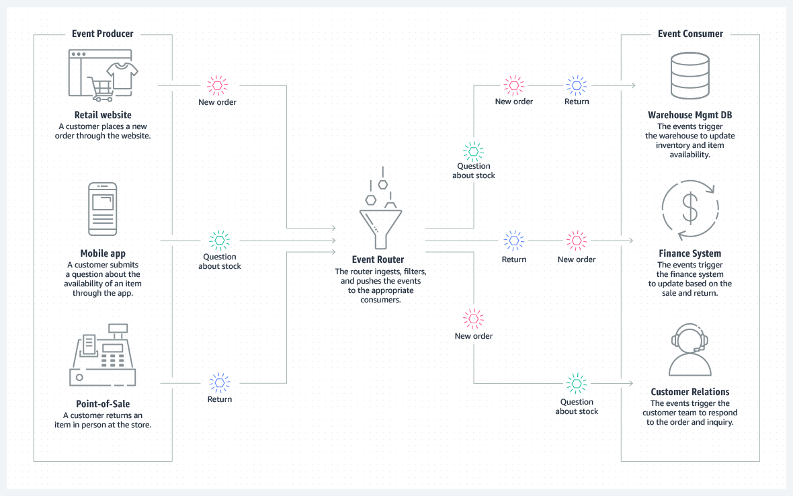

# Event-Driven Architectures on AWS

An event-driven architecture uses events to invoke and communicate between decoupled services.

An event is a change in state, or an update, such as placing an item in a shopping cart on an ecommerce website. 

Event-driven architectures have three key components: 

- event producers
- event routers
- event consumers

A producer publishes an event to the router, which filters and pushes the events to consumers. 

> The following diagram shows an example of an event-driven architecture for an ecommerce site. By using this architecture, the site can react to changes from various sources during times of peak demand, without crashing the application or overprovisioning resources.

