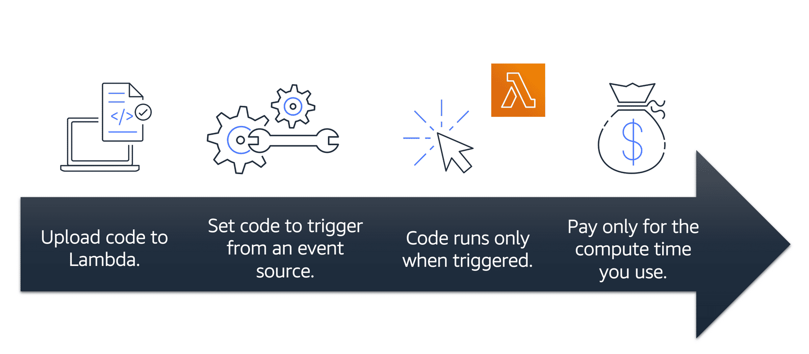

# AWS Lambda

AWS Lambda is a serverless compute service. It supports web backends and runs in response to events or triggers.

Lambda functions run in their own secure and isolated runtime environments (execution environments). You cannot log in to compute instances or customize the runtime's operating system.

Lambda functions have a maximum runtime limit of 15 minutes.

When using Lambda, you are responsible only for your code.

Lambda manages the compute fleet, balancing memory, CPU, network, and other resources. Lambda handles operational and administrative activities like capacity management, monitoring, and logging.

Use cases: web backends, IoT backends, mobile backends, data processing, ...

## How Lambda Works

There are three primary components of a Lambda function: the trigger, code, and configuration.

The **code** is source code, that describes what the Lambda function should run.

When you create your Lambda function, you specify the **runtime** you want your code to run in. There are built-in runtimes such as Python, Node.js, Ruby, Go, Java, .NET Core, or you can implement your Lambda functions to run on a custom runtime.

The **configuration** of a Lambda function consists of information that describes how the function should run. In the configuration, you specify network placement, environment variables, memory, invocation type, permission sets, and other configurations.

**Triggers** describe when the Lambda function should run. A trigger integrates your Lambda function with other AWS services, enabling you to run your Lambda function in response to certain API calls that occur in your AWS account. 

1. You upload your code to Lambda. 
1. You set your code to trigger from an event source, such as AWS services, mobile applications, or HTTP endpoints.
1. Lambda runs your code only when triggered.
1. You pay only for the compute time that you use. 

## Billing Granularity

You pay only for the compute time that you consume. Charges apply only when your code is running, rounded up to the nearest 1ms (duration).

AWS rounds up duration to the nearest millisecond with no minimum execution time.

It can be very cost effective to run functions whose execution time is very low, such as functions with durations under 100ms or low latency APIs.

## AWS Lambda Power Tuning

AWS Lambda Power Tuning is an open-source tool that helps find the most optimal memory and CPU allocation for your lambda functions.

It runs in your own AWS account, and it supports three optimization strategies: cost, speed, and balanced.

To work with AWS Lambda Power Turning, you provide a Lambda function Amazon Resource Name (ARN) as input. It then invokes that function with multiple power configurations. Then, it analyzes all the execution logs and suggests the best power configuration to minimize cost or maximize performance.

AWS Lambda Power Turning also supports cross-Region invocations, and you can enable parallel execution to generate results in a few seconds.

> For example, the following diagram shows results for two CPU-intensive functions, which become both cheaper and faster with more power.

## AWS Lambda Powertools

AWS Lambda Powertools helps you optimize your Lambda functions and use best practices. 

AWS Lambda Powertools is a suite of utilities for AWS Lambda functions that is designed to make it easier to adopt best practices such as tracing, structured logging, custom metrics, idempotency, batching, and more. 

## Reuse execution environment 

An optimization technique is to move certain initialization tasks in your code so they are outside the handler. These tasks can then be reused across invocations (which is also known as execution environment reuse).

> To do this, initialize SDK clients and database connections outside of the function handler, and cache static assets locally in the /tmp directory. Subsequent invocations that are processed by the same instance of your function can reuse these resources. This reuse saves cost by reducing function run time. 

To avoid potential data leaks across invocations, don’t use the execution environment to store user data, events, or other information with security implications.