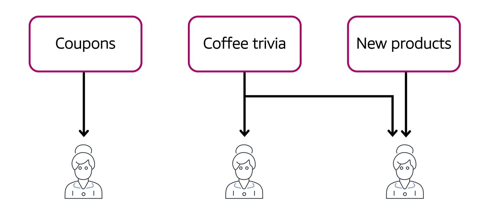

# Amazon Simple Notification Service (Amazon SNS)

Amazon Simple Notification Service (Amazon SNS) is a publish/subscribe service.

Using Amazon SNS topics, a publisher publishes messages to subscribers. Subscribers can be web servers, email addresses, AWS Lambda functions, or several other options.

It is possible for subscribers to subscribe to a single topic or to multiple topics.

