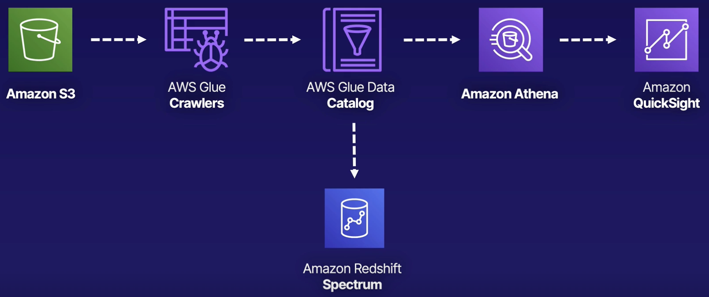

# Amazon Athena

Athena is an interactive query service that makes it easy to analyze data in S3 using SQL. This allows you to directly query data in your S3 bucket without loading it into a database.

Most results are delivered within seconds.

Athena is serverless, you pay only for the queries that you run.

If you're ever faced with a scenario that's looking for a serverless SQL solution, Athena is your best choice. It's the only service that allows you to directly query your data that's stored in S3.

To use Athena, you point to your data in Amazon S3, define the schema, and start querying by using standard SQL. You don’t need complex ETL jobs to prepare your data for analysis.

# Amazon Glue

Glue is a serverless data integration service that makes it easy to discover, prepare, and combine data.

It allows you to perform ETL workloads without managing underlying servers (it replaces EMR).

Glue is a serverless ETL.

Glue can design a schema for your data.

## Architecture diagram

To start, unstructured data is stored in S3 and needs to be formatted for easy querying.

Glue can be used to create a catalog and structure for the data.

Redshift Spectrum can be used to query data without loading it into the Redshift database, while Athena can run queries on Glue-structured data without loading it into any database.

QuickSight can be used to visualize the data and create a dashboard for insights.

