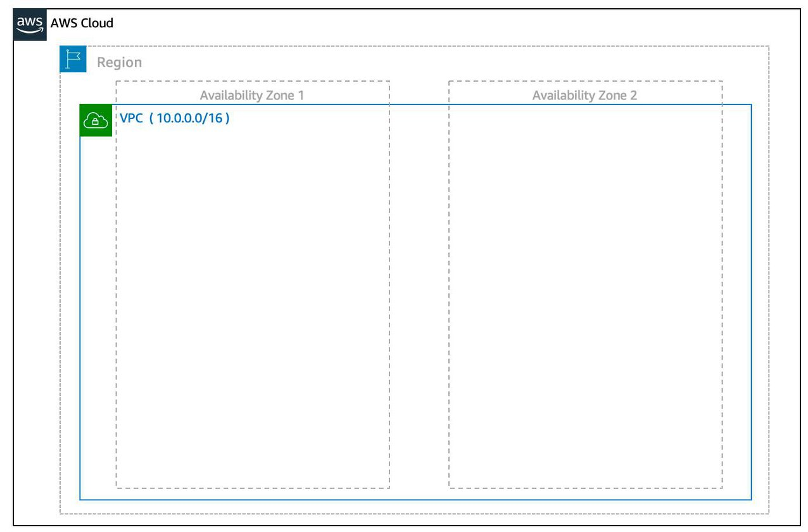
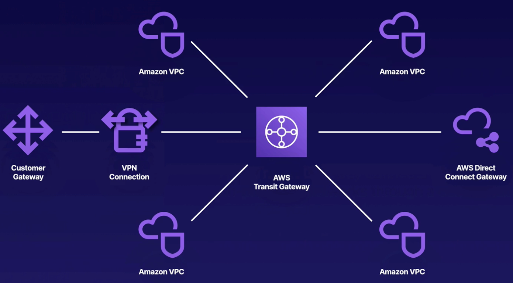

# Amazon Virtual Private Cloud (VPC)

## What is a VPC?

A VPC is an isolated network you create in the AWS cloud, similar to a traditional network in a data center.

You have complete control of virtual network, including your own IP address range, subnets, route tables, and network gateways.

When you create a VPC, you need to choose three main things.

- The name of your VPC.
- A Region for your VPC to live in. A VPC can span multiple AZ within that Region.
- A IP range for your VPC in CIDR notation.

When we creat a VPC, it's going to create a route table, a network ACL, a router, a security group.

A VPC can only have one internet gateway attached.

## Subnet

A subnet is a section of a VPC that can contain resources (such as Amazon EC2 instances)

1 subnet is always in 1 AZ.

When you create a subnet, you need to choose three settings.

- The  VPC you want your subnet to live in, in this case VPC (`10.0.0.0/16`).
- The Availability  Zone you want your subnet to live in, in this case `AZ1`.
- A CIDR  block for your subnet, which must be a subset of the VPC CIDR block, in  this case `10.0.0.0/24`.

### Public and private subnet

Subnets can be public or private.

**Public subnets** contain resources that need to be accessible by the public, such as an online store’s website. You need to enable "auto-assign piblic IPv4 address" in subnet setting.

**Private subnets** contain resources that should be accessible only through your private network, such as a database.

In a VPC, subnets can communicate with each other. For example, you might have an application run in an Amazon EC2 instance in a public subnet communicating with databases that are located in a private subnet.

### Reserved IPs

For AWS to configure your VPC appropriately, AWS reserves five IP addresses in each subnet. These IP addresses are used for routing, Domain Name System (DNS), and network management.

*For example, consider a VPC with the IP range `10.0.0.0/22`. The VPC includes 1,024 total IP addresses. This is divided into four equal-sized subnets, each with a `/24` IP range with 256 IP addresses. Out of each of those IP ranges, there are only 251 IP addresses that can be used because AWS reserves five.*

### Best practices

- **Maintain redundancy and fault tolerance**: When you create your subnets, create at least two subnets configured in two different Availability Zones. In this case, if one of these AZs fail, you still have your resources in another AZ available as backup.
  
- **Setting IP range**: A common practice is to create a VPC with a IP range of `/16` and create subnets with a IP range of `/24`. This provides a large amount of IP addresses to work with at both the VPC and subnet level.

## Default VPC

Every AWS account comes with a default VPC in every region.

Default VPC is user friendly. All their subnets have a route out to the internet. You don't have to worry about networking components.

Each EC2 instance in the default VPC has both a public and private IP address.

## Internet Gateway

To allow public traffic from the internet to access your VPC, you attach an internet gateway to the VPC.

## NAT Gateways

You can use a network address translation (NAT) gateway to enable instances in a private subnet to connect to the internet or other AWS services while **preventing the internet** from initiating a connection with those instances.

A NAT gateway is a VPC component that run inside a subnet, which is belong to an AZ. It's scalable, starts at 5 Gbps to 45 Gbps.

Need to be assigned an public IP address to work.

NAT gateways are not associated with security groups.

To enable internet access for instances in private subnets:
- Create a NAT Gateway in the public subnet.
- In the route table of the private subnet, add a route to direct network traffic to the NAT gateway.

## Virtual Private Gateway

If you want to connect to instances in private subnets, we could attach a virtual private gateway to our VPC, establish an VPN connection, and then you can communicate to instances in private subnets.

> Once you create and attach a VGW to a VPC, the gateway acts as anchor on the AWS side of the connection. On the other side of the connection, you'll need to connect a customer gateway to the other private network.
>
> A customer gateway device is a physical device or software application on your side of the connection. Once you have both gateways, you can then establish an encrypted VPN connection between the two sides.

## VPC Endpoints

You use VPC Endpoints when you want to **connect your VPC to AWS services without leaving the Amazon internal network**.

They are horizontally scaled, redundant, and highly available VPC components that allow communication between instances in your VPC and services **without imposing availability risks or bandwidth constraints on your network traffic**.

Instances in your VPC do not require public IP addresses to communicate with resources in the service.

There're two types of VPC Endpoints:
- Interface endpoint: is an elastic network interface with a private IP address, serves as an entry point for traffic headed to another AWS services. Support a large number of AWS services.
- Gateway endpoints: similar to NAT gateways, is a virtual device you provision. Support S3 and DynamoDB

## VPC Peering

Allows you to **connect 1 VPC with another via a direct network route** using private IP addresses.

Instances behave as if they were on the same private network.

You can peer VPCs with other AWS accounts as well as with other VPCs in the same account.

You can peer between regions.

Peering is one to one. No transitive peering.

If VPCs have the same CIDR address range, it wouldn't work.

## AWS PrivateLink

PrivateLink is the best way to **expose a service in your VPC to tens, hundreds, or thousands of customer VPCs**.

Doesn't require VPC peering; no route tables, NAT gateways, internet gateways, etc.

Requires a Network Load Balancer on the service VPC and an ENI on the customer VPC.

## VPN CloudHub

If you have multiple sites, each with its own VPN connection, you can use
AWS VPN CloudHub to connect those sites together, it helps you to secure your VPN Hub.

AWS VPN CloudHub is low cost and easy to manage. Though it operates over the public internet, all traffic between the customer gateway and the AWS VPN CloudHub is encrypted.

## Direct Connect

AWS Direct Connect is a service that enables you to establish a dedicated **connection from your premises to AWS**.

You can reduce your network costs, increase bandwidth throughput, and provide a more consistent network experience than internet-based connections.

Helpful when you need a stable and reliable secure connection.

### Types of Direct Connect Connection

- **Dedicated Connection**: A physical Ethernet connection associated with a single customer. Customers can request a dedicated connection through the AWS Direct Connect console, the CLI, or the API.
- **Hosted Connection**: A physical Ethernet connection that an AWS Direct Connect
Partner provisions on behalf of a customer. Customers request a hosted connection by contacting a partner in the AWS Direct Connect Partner Program, who provisions the connection.

### VPNs vs. Direct Connect

VPNs allow private communication, but it still traverses the public internet to get the data delivered. While secure, it can be painfully slow.

Direct Connect is Fast, Secure, Reliable, Able to take massive throughout. For the last level of security, you can run a VPN over a Direct Connect connection.

## Transit Gateway

AWS Transit Gateway connects VPCs and on-premises networks through a central hub. This **simplifies your network** and puts an end to complex peering relationships. It acts as a cloud router - each new connection is only made once.

- Allows you to have transitive peering between thousands of VPCs and on-premises data centers.
- Works on a hub-and-spoke model.
- Works on a regional basis, but you can have it across multiple regions.
- You can use it across multiple AWS accounts using RAM (Resource Access Manager).
- You can use route tables to limit how VPCs talk to one another.
- Works with Direct Connect as well as VPN connections.
- Supports IP multicast: send a packet to thousand of hosts across a routed network.

## AWS Wavelength

AWS Wavelength embeds AWS compute and storage services within 5G networks, providing mobile edge computing infrastructure for developing, deploying, and scaling ultra-low-latency applications.

If the scenario is about 5G, mobile edge computing, think of AWS Wavelength.