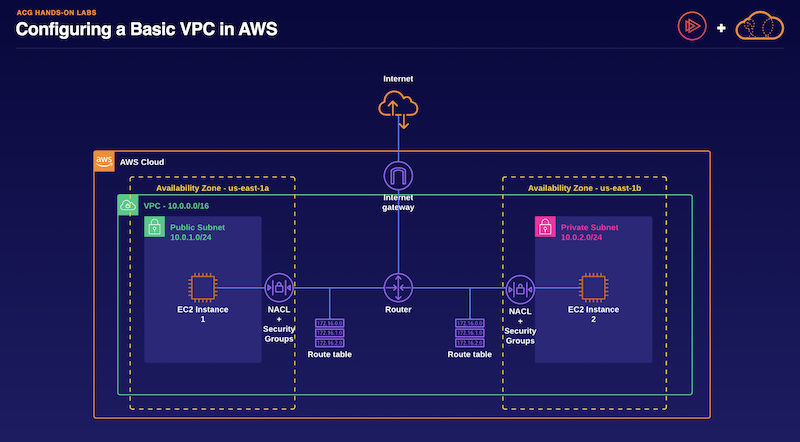

# Guide: Configuring a Basic VPC



## Create a VPC

Navigate to the VPC console.

**Note:** *Do not use the VPC Wizard to create your VPC; instead, configure your VPC from scratch and use the **VPC Only** option.*

Create a new VPC with the following values:

- **VPC Name**: *HoLVPC*
- **IPv4 CIDR block**: *10.0.0.0/16*
- **IPv6 CIDR block**: **No IPv6 CIDR block**
- **Tenancy**: **Default Tenancy**

**Note:** *Windows users who will be using PuTTY will need to enable DNS hostnames for the VPC once it has been created.*


## Create a Public and Private Subnet

Build two subnets for your VPC. One will be public to allow access from the internet and one will be private. Ensure you are assigning the valid CIDR blocks when creating your subnets.

### Create Public Subnet

In the VPC console, create a new subnet with the following values:

- **Name**: *hol-public-a*
- **VPC**: Use the VPC ID of **HoLVPC**
- **Availability Zone**: **us-east-1a**
- **IPv4 CIDR Block**: *10.0.1.0/24*

**Note:** *Although the name of our subnet is hol-public-a, it is not actually public until the subnet has a route to an internet gateway. We will set this up later on in the lab.*

### Create Private Subnet

In the VPC console, create a new subnet with the following values:

- **Name**: *hol-private-b*
- **VPC**: Use the VPC ID of **HoLVPC**
- **Availability Zone**: **us-east-1b**
- **IPv4 CIDR Block**: **10.0.2.0/24**


## Create Routes and Internet Gateway

### Auto-Assign Public IPv4 Address

Automatically request a public IPv4 address for instances launched into the public subnet.

In the VPC console, enable the **Auto-assign public IPv4 address** feature for the **hol-public-a** subnet.

### Configure Internet Gateway

An internet gateway enables communication over the internet.

In the VPC console, create a new internet gateway with the name *hol-VPCIGW* and attach the newly created internet gateway to **HoLVPC**.

### Configure Routing

- Create a new route table for **HoLVPC** to tell traffic in the public subnet, **hol-public-a**, how to get to the Internet. Use the following values:
    - **Name Tag**: *publicRT*
    - **VPC**: **HoLVPC**
- Add a new route to the **publicRT** route table, with the following values:
    - **Destination**: *0.0.0.0/0*
    - **Target**: Use the ID of the **hol-VPCIGW** internet gateway

### Associate with Subnets

In the VPC console, update the **publicRT** route table so that the **hol-public-a** subnet is associated with the public route table and will have access to the internet.


## Launch an EC2 Instance in the Public Subnet

- Navigate to the **EC2** service.
- Launch a new EC2 instance with the following configuration and values:
    - **Name**: *hol-pub-instance*
    - **Amazon Machine Image (AMI)**: Use the latest **Amazon Linux 2 AMI**
    - **Architecture**: **64-bit (x86)**
    - **Instance Type**: **t3.micro**
    - **Key Pair**: Create a new key pair called *vpcpubhol*
    - **VPC**: Use the VPC ID of **HoLVPC**
    - **Subnet**: Use the **hol-public-a** subnet
    - **Auto-assign public IP**: **enable**
- While creating the EC2 instance, also create a new security group for the instance called *holpubSG*.
- Create a new rule for the security group to allow *SSH* traffic from the **HoLVPC** network (**10.0.0.0/16**) and your own IP address.
- Launch the new public instance and wait a few minutes for the instance to go into a running state.


## Launch an EC2 Instance in the Private Subnet

In the **EC2** console, launch a new EC2 instance with the following configuration and values:

- **Name**: *hol-priv-instance*
- **Amazon Machine Image (AMI)**: Use the latest Amazon Linux 2 AMI
- **Architecture**: **64-bit (x86)**
- **Instance Type**: **t3.micro**
- **Key Pair**: Create a new key pair called *vpcprivhol*
- **VPC**: Use the VPC ID of **HoLVPC**
- Under **Security group name**, change the name by typing in *holprivSG*.
- Under **Description - *required***, type *holprivSG*.
- Under **Security Group rule 1**, set the following fields:

```
* **Type**: Select **ssh**
* **Source type**: Select **Custom**
* **Source**: Type *10.0.0.0/16*

```

- **Subnet**: Use the **hol-private-b** subnet
- **Auto-assign public IP**: **disabled**


## Access Instances

After the state on both Instances show as **Running** and have 2/2 status checks, connect to the EC2 instances using the **SSH** client of your choice and the key pair for the instance.

**Note:** *You will be able to connect to the public instance using the assigned public IP address, but to connect to the private instance, you will need to copy the **vpcprivhol** key to the public instance. From the public instance, using the **vpcprivhol** key, you will be able to SSH into the private instance with the private IP address.*


## Add a Network ACL

- In the VPC console, add the following rule to the *Network ACL* for the **HoLVPC** VPC:
    - **Rule #**: *50*
    - **Type**: **All Traffic**
    - **Source**: Use your IP address
    - **Allow/Deny**: **DENY**
- Attempt to connect to your public instance using the SSH client of your choice. You should receive an error message.
- Update the **Network ACL** for **HoLVPC** and remove rule #50.
- Once again, attempt to connect to your public instance using the SSH client of your choice. You should be able to connect successfully now.