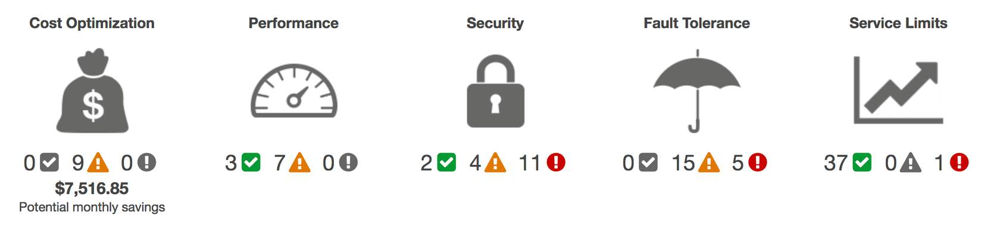

# Auditing

## AWS Config

This service records your AWS configuration, changes to that configuration, or a history, and even change notifications, so you're notified proactively.

It will discover these existing AWS resources and generate a full inventory, along with all the actual configuration details, for you. You can then determine how a resource was configured at any point in time.

You can tie this into the aforementioned AWS CloudTrail, so that you gain full visibility into who made the actual change at that point in time and what the change was.

https://aws.amazon.com/config/

## Amazon Inspector

[Amazon Inspector](https://aws.amazon.com/inspector) helps to improve the security and compliance of applications by running automated security assessments.

It checks applications for security vulnerabilities and deviations from security best practices, such as open access to Amazon EC2 instances and installations of vulnerable software versions. 

After performing an assessment, Amazon Inspector produces a detailed list of security findings prioritized by level of severity and a recommendation for how to fix it.

## AWS Trusted Advisor

[AWS Trusted Advisor](https://aws.amazon.com/premiumsupport/technology/trusted-advisor) is a web service that inspects your AWS environment and provides real-time recommendations in accordance with AWS best practices.

Trusted Advisor compares its findings to AWS best practices in five categories: cost optimization, performance, security, fault tolerance, and service limits.

Trusted Advisor offers a list of recommended actions and additional resources to learn more about AWS best practices. 

> You can use AWS Trusted Advisor to assist you while you are creating new workflows and developing new applications. Or you can use it while you are making ongoing improvements to existing applications and resources.

### AWS Trusted Advisor Dashboard

When you access the Trusted Advisor dashboard on the AWS Management Console, you can review completed checks for cost optimization, performance, security, fault tolerance, and service limits.

For each category:

- The green check indicates the number of items for which it detected **no problems**.
- The orange triangle represents the number of recommended **investigations**.
- The red circle represents the number of recommended **actions**.