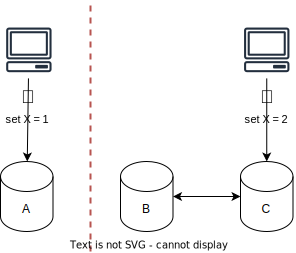
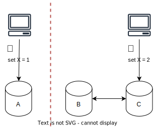

# CAP Theorem

## Overview

The CAP Theorem (aka Brewer’s Theorem) is a fundamental principle in distributed systems.

It states that when network partitioning occurs, a system cannot be both consistent and highly available.

"CAP" stands for:
1. **Consistency**: all nodes see the same data, may not be able to write
2. **Availability**: all nodes are able to write, may not see the same data
3. **Partition Tolerance**: The system continues to operate even if a network partition causes communication errors between subsystems

## Network Partition

A **Network Partition** refers to a break in the network that prevents communication between nodes in a distributed system. 

This means some nodes cannot access data on other nodes, which challenges the system's ability to maintain consistency and availability simultaneously.

To always ensure partition tolerance (P), a system must choose between consistency (C) and availability (A).

## Misunderstanding

Some explanations tell you that you must pick two among Consistency, Availability, and Partition Tolerance. However, they are incorrect.

In fact, in the theorem, Network Partitioning is assumed as a given condition you must accept, and your choice is only between consistency and availability.

## Example

Let's say we have a distributed system with three nodes: A, B, and C.

When a network partition occurs at node A, it cannot connect with the others.

Now, there are two requests sent to nodes A and C that update the same record with different values.

If our system favors consistency, it will fail both requests, putting the cluster in read-only mode.

Alternatively, if the system favors availability, it will allow the updates, resulting in an inconsistent state.

When the network partition is resolved, we must address the conflict between nodes. Some strategies include:
- **Majority-based**: The record with the majority value is propagated to all nodes.
- **Timestamp-based**: The record with the latest timestamp is chosen.
