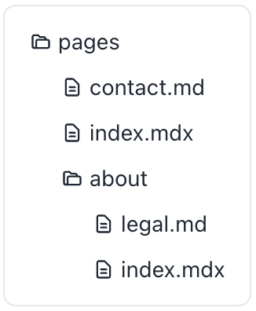
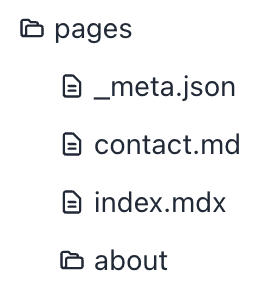

# Organize Files

## `pages` directory

Nextra collects all your Markdown files and configurations from the pages directory, and then generates the “page map information” of your entire site, to render things such as the navigation bar and sidebar.

By default, the page map contains all `.md` and `.mdx` filenames and the directory structure.

For example if you have the following structure:



The resolved page map will be (note that all names were sorted alphabetically):

```json
[
  {
    "name": "About",
    "children": [{ "name": "Index" }, { "name": "Legal" }]
  },
  { "name": "Contact" },
  { "name": "Index" }
]
```

## `_meta.json`

It's very common to customize each page's title, rather than just relying on filenames.

You can have an `_meta.json` file in each
directory, and it will be used to override the default configuration of each page:



And you can put this in your `pages/_meta.json` file:

```json
{
  "index": "My Homepage",
  "contact": "Contact Us",
  "about": {
    "title": "About Us",
    "...extra configurations...": "..."
  }
}
```

It tells Nextra the order of each page, and the correct title.