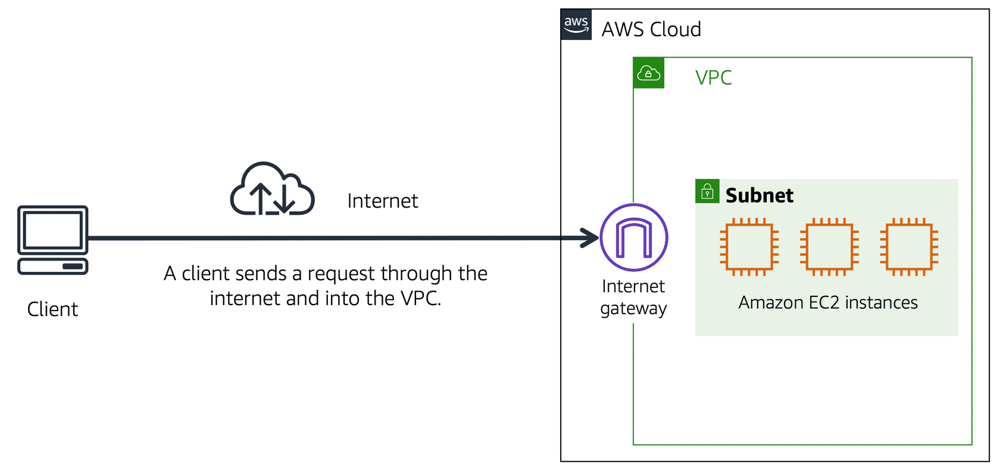
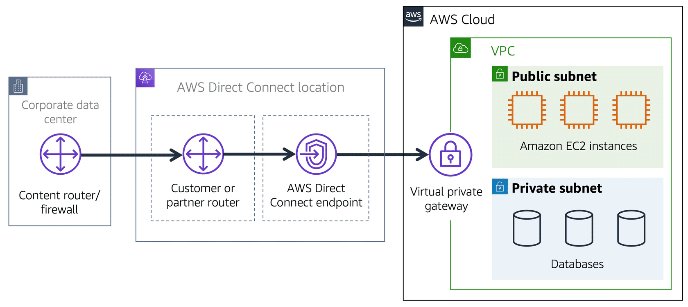

# Connect your VPC to other networks

## Internet Gateway

To allow public traffic from the internet to access your VPC, you attach an internet gateway to the VPC.

## NAT Gateways

You can use a network address translation (NAT) gateway to enable instances in a private subnet to connect to the internet or other AWS services while **preventing the internet** from initiating a connection with those instances.

A NAT gateway is a VPC component that run inside a subnet, which is belong to an AZ. It's scalable, starts at 5 Gbps to 45 Gbps.

Need to be assigned an public IP address to work.

NAT gateways are not associated with security groups.

To enable internet access for instances in private subnets:
- Create a NAT Gateway in the public subnet.
- In the route table of the private subnet, add a route to direct network traffic to the NAT gateway.

## VPC Peering

Allows you to **connect 1 VPC with another via a direct network route** using private IP addresses.

Instances behave as if they were on the same private network.

You can peer VPCs with other AWS accounts as well as with other VPCs in the same account.

You can peer between regions.

Peering is one to one. No transitive peering.

If VPCs have the same CIDR address range, it wouldn't work.

## VPC Endpoints

You use VPC Endpoints when you want to **connect your VPC to AWS services without leaving the Amazon internal network**.

They are horizontally scaled, redundant, and highly available VPC components that allow communication between instances in your VPC and services **without imposing availability risks or bandwidth constraints on your network traffic**.

Instances in your VPC do not require public IP addresses to communicate with resources in the service.

There're two types of VPC Endpoints:
- Interface endpoint: is an elastic network interface with a private IP address, serves as an entry point for traffic headed to another AWS services. Support a large number of AWS services.
- Gateway endpoints: similar to NAT gateways, is a virtual device you provision. Support S3 and DynamoDB

## Virtual Private Gateway

If you want to connect to instances in private subnets, we could attach a virtual private gateway to our VPC, establish an VPN connection, and then you can communicate to instances in private subnets.

> Once you create and attach a VGW to a VPC, the gateway acts as anchor on the AWS side of the connection. On the other side of the connection, you'll need to connect a customer gateway to the other private network.
>
> A customer gateway device is a physical device or software application on your side of the connection. Once you have both gateways, you can then establish an encrypted VPN connection between the two sides.

## Transit Gateway

AWS Transit Gateway connects VPCs and on-premises networks through a central hub. This **simplifies your network** and puts an end to complex peering relationships. It acts as a cloud router - each new connection is only made once.

- Allows you to have transitive peering between thousands of VPCs and on-premises data centers.
- Works on a hub-and-spoke model.
- Works on a regional basis, but you can have it across multiple regions.
- You can use it across multiple AWS accounts using RAM (Resource Access Manager).
- You can use route tables to limit how VPCs talk to one another.
- Works with Direct Connect as well as VPN connections.
- Supports IP multicast: send a packet to thousand of hosts across a routed network.

## AWS Virtual Private Network

You can connect your VPC to remote networks using the following VPN connectivity options:

### AWS Site-to-Site VPN

You can create an IPsec VPN connection between your VPC and your remote network.

On the AWS side of the Site-to-Site VPN connection, a **virtual private gateway** or **transit gateway** provides two VPN endpoints (tunnels) for automatic failover. 

You configure your customer gateway device on the remote side of the Site-to-Site VPN connection.

### AWS Client VPN

AWS Client VPN is a managed client-based VPN service that enables you to securely access your AWS resources or your on-premises network.

With AWS Client VPN, you configure an endpoint to which your users can connect to establish a secure TLS VPN session. This enables clients to access resources in AWS or on-premises from any location using an OpenVPN-based VPN client.

### VPN CloudHub

If you have multiple sites, each with its own VPN connection, you can use
AWS VPN CloudHub to connect those sites together, it helps you to secure your VPN Hub.

AWS VPN CloudHub is low cost and easy to manage. Though it operates over the public internet, all traffic between the customer gateway and the AWS VPN CloudHub is encrypted.

## Direct Connect

AWS Direct Connect is a service that enables you to establish a dedicated **connection from your premises to AWS**.

You can reduce your network costs, increase bandwidth throughput, and provide a more consistent network experience than internet-based connections.

Helpful when you need a stable and reliable secure connection.

### Types of Direct Connect Connection

- **Dedicated Connection**: A physical Ethernet connection associated with a single customer. Customers can request a dedicated connection through the AWS Direct Connect console, the CLI, or the API.
- **Hosted Connection**: A physical Ethernet connection that an AWS Direct Connect
Partner provisions on behalf of a customer. Customers request a hosted connection by contacting a partner in the AWS Direct Connect Partner Program, who provisions the connection.

### VPNs vs. Direct Connect

VPNs allow private communication, but it still traverses the public internet to get the data delivered. While secure, it can be painfully slow.

Direct Connect is Fast, Secure, Reliable, Able to take massive throughout. For the last level of security, you can run a VPN over a Direct Connect connection.

## AWS PrivateLink

PrivateLink is the best way to **expose a service in your VPC to tens, hundreds, or thousands of customer VPCs**.

Doesn't require VPC peering; no route tables, NAT gateways, internet gateways, etc.

Requires a Network Load Balancer on the service VPC and an ENI on the customer VPC.

