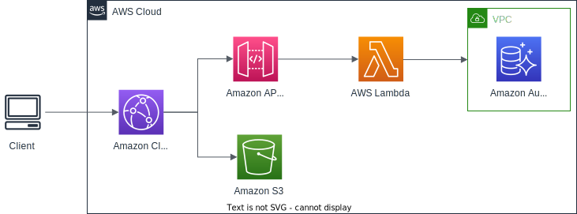

# Amazon API Gateway

## Overview

Amazon API Gateway is a fully managed service that allows you to easily publish, create, maintain, monitor, and secure your API.

Features:
- Support WebSocket Protocol
- Handle API versioning (v1, v2...)
- Handle different environments (dev, test, prod...)
- Handle security (Authentication and Authorization)
- Support API keys and Usage Plans, quota management
- Handle request throttling
- Allow importing and exporting Swagger / Open API to quickly define APIs
- Can transform and validate requests and responses
- Generate SDK and API specifications
- Cache API responses

Allow creating 3 types of API:
- **REST API**: allow you to create and leverage things like API keys, per-client throttles, requests validation, Web application firewall (WAF) integration.
- **HTTP API**: simpler option than REST API, cheaper, minimal features.
- **WebSocket API**: collection of WebSocket routes, integrated with Lambda functions, HTTP endpoints, other AWS services.

The maximum amount of time that an API gateway can perform any request is 29 seconds.

## API Types

### REST API

- A collection of HTTP resources and methods that are integrated with backend HTTP endpoints, Lambda functions, or other AWS services.
- This collection can be deployed in one or more stages.

### WebSocket API

- A collection of WebSocket routes and route keys that are integrated with backend HTTP endpoints, Lambda functions, or other AWS services.
- The collection can be deployed in one or more stages.
- API methods are invoked through frontend WebSocket connections that you can associate with a registered custom domain name.

## Domain

API Gateway use HTTPS endpoints only.

By default API Gateway assigns an internal domain that automatically uses the API Gateway certificates.

To use custom domain names:
- You must set up a CNAME or A-alias record in Route53
- You can provide the certificate through integration with AWS Certificate Manager.
- If using Edge-Optimized endpoint, then the certificate must be in `us-east-1`
- If using Regional endpoint, the certificate must be in the API Gateway's region

## Integrating with other AWS Services

### AWS Lambda
- Can API Gateway invoke Lambda function to create a serverless REST API backed by AWS Lambda
- It's an easy way to expose Lambda function to outside world

### HTTP

- API Gateway can sit in front of any HTTP endpoints in the backend.
- It could be: an internal HTTP API on-premises or an Application Load Balancer.
- Benefit: allows leveraging API Gateway's features (rate limiting, caching, authentication, API keys, ...).

### AWS WAF
AWS WAF can be used to protect against DDoS and layer 7 attacks when placed in front of your API.

### AWS Service

- You can expose any AWS service through the API Gateway.
- Example: start an AWS Step Function workflow, post a message to SQS.
- Benefits: expose services to the public, leveraging API Gateway's features.

## Scenarios

### Kinesis Data Streams

We want to have people send data into a Kinesis Data Streams in a secure way,

To do that, the clients will send HTTP request into the API Gateway. And it's been configured to then send the messages into a Kinesis Data Streams (we don't have to manage any servers).

Then from Kinesis Data Stream, we can send the records into a Kinesis Data Firehose and eventually put them into an Amazon S3 bucket in the JSON format.

### CloudFront

A backend application that uses serverless technology.

The HTTP request is sent from client to Amazon CloudFront. 

The CloudFront distribution leverages different backend services such as API Gateway and Amazon S3 for specific path patterns.

API Gateway is deployed and published to many different AWS Lambda functions that perform various functions including reaching into an Amazon Aurora database.

This allows for API Gateway to front internal private services and interact with those services that live within things like a VPC and a private subnet.

