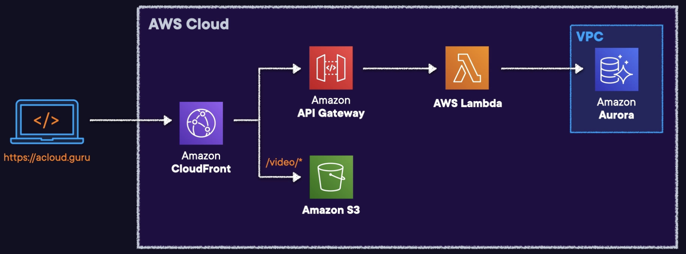

# Amazon API Gateway

## Overview

Amazon API Gateway is a fully managed service that allows you to easily publish, create, maintain, monitor, and secure your API.

Integrates with Lambda functions, HTTP endpoints, and other AWS services.

API calls include traffic management, authorization and access control, monitoring, and API version management.

Supports API keys and Usage Plans for user identification, throttling or quota management.

There're 3 types of options for us when creating an API using API Gateway.

- **REST API**: allow you to create and leverage things like API keys, per-client throttles, requests validation, Web application firewall (WAF) integration.
- **HTTP API**: simpler option than REST API, cheaper, minimal features.
- **WebSocket API**: collection of WebSocket routes, integrated with Lambda functions, HTTP endpoints, other AWS services.

Use HTTPS endpoints only.

By default API Gateway assigns an internal domain that automatically uses the API Gateway certificates. When configuring your APIs to run under a custom domain name you can provide your own certificate.

CloudFront is used as the public endpoint for API Gateway.

**AWS WAF** can be used to protect against DDoS and layer seven attacks when placed in front of your API.

## Features

**Security**: provides multiple tools to authorize access to APIs and control service operation access.

**Resiliency**: Manage traffic with throttling so that backend operations can withstand traffic spikes.

**Private integrations with AWS ELB & AWS Cloud Map**:
- you can route requests to private resources in your VPC
- you can build APIs for services behind private ALBs, private NLBs, and IP-based services registered in AWS Cloud Map, such as ECS tasks.

**Metering**: Define plans that meter and restrict third-party developer access to APIs.

**Operations Monitoring**: provides a metrics dashboard to monitor calls to services.

**Lifecycle Management**: Operate multiple API versions and multiple stages for each version simultaneously so that existing applications can continue to call previous versions after new API versions are published.

## API Types

### REST API

- A collection of HTTP resources and methods that are integrated with backend HTTP endpoints, Lambda functions, or other AWS services.
- This collection can be deployed in one or more stages.

### WebSocket API

- A collection of WebSocket routes and route keys that are integrated with backend HTTP endpoints, Lambda functions, or other AWS services.
- The collection can be deployed in one or more stages.
- API methods are invoked through frontend WebSocket connections that you can associate with a registered custom domain name.

## Deployments

Deployments are a snapshot of the APIs resources and methods.

Deployments must be created and associated with a stage for anyone to access the API.

## Stages

A stage is a logical reference to a lifecycle state of your REST or WebSocket API (for example, ‘dev’, ‘prod’, ‘beta’, ‘v2’).

API stages are identified by API ID and stage name.

## Stage variables
Stage variables are like environment variables for API Gateway.

Stage variables can be used in:
- Lambda function ARN.
- HTTP endpoint.
- Parameter mapping templates.

Use cases for stage variables:
- Configure HTTP endpoints your stages talk to (dev, test, prod etc.).
- Pass configuration parameters to AWS Lambda through mapping templates.

Stage variables are passed to the "context" object in Lambda.

Stage variables are used with Lambda aliases. You can create a stage variable to indicate the corresponding Lambda alias.

You can create canary deployments for any stage – choose the % of traffic the canary channel receives.

## Mapping templates

Mapping templates can be used to modify request / responses:
- Rename parameters.
- Modify body content.
- Add headers.
- Map JSON to XML for sending to backend or back to client.
- Uses Velocity Template Language (VTL).
- Filter output results (remove unnecessary data).

## Caching

Caching allows you to cache the endpoint’s response.

Caching can reduce the number of calls to the backend and improve the latency of requests to the API.

API Gateway caches responses for a specific amount of time. The default TTL is 300 seconds (min 0, max 3600).

Caches are defined per stage.

You can encrypt caches.

The cache capacity is between 0.5GB to 237GB.

It is possible to override cache settings for specific methods.

You can flush the entire cache (invalidate it) immediately if required.

Clients can invalidate the cache with the header: `Cache-Control: max-age=0` .

## API throttling

API Gateway sets a limit on a steady-state rate and a burst of request submissions against all APIs in your account.
- **steady-state rate**: the average number of requests per second that your API receives over a period of time
- **burst**: the maximum number of requests that your API can handle in a short period of time

By default API Gateway limits the steady-state request rate to 10,000 requests per second.

The maximum concurrent requests is 5,000 requests across all APIs within an AWS account.

When the number of request exceeds the limits, you will receive a **429 Too Many Requests** error response.

Amazon API Gateway provides two basic types of throttling-related settings:

- **Server-side throttling** limits are applied across all clients. These limit settings exist to prevent your API—and your account—from being overwhelmed by too many requests.
- **Per-client throttling** limits are applied to clients that use API keys associated with your usage policy as a client identifier.

API Gateway throttling-related settings are applied in the following order:

1. Per-client per-method throttling limits that you set for an API stage in a usage plan.
1. Per-client throttling limits that you set in a usage plan.
1. Default per-method limits and individual per-method limits that you set in API stage settings.
1. Account-level throttling.

## Usage plans

A usage plan specifies who can access one or more deployed API stages and methods — how much and how fast they can access them.

You can use a usage plan to configure throttling and quota limits, which are enforced on individual client API keys. The plan uses API keys to identify API clients and meters access to the associated API stages for each key.

It also lets you configure throttling limits and quota limits that are enforced on individual client API keys.

## API keys

API keys are alphanumeric string values that you distribute to app developer customers to grant access to your API.

You can use API keys together with usage plans or Lambda authorizers to control access to your APIs.

You can generate an API key in API Gateway or import it into API Gateway from an external source.

## Open API / Swagger

Can import existing Swagger / Open API 3.0 definitions (written in YAML or JSON) to API Gateway.

Can also export current APIs as Swagger / Open API 3.0 definition.

With the import API you can either create a new API by submitting a POST request that includes a Swagger definition in the payload and endpoint configuration, or you can update an existing API by using a PUT request that contains a Swagger definition or merge a definition with an existing API. You specify the options using a mode query parameter in the request URL.

## Architecture Diagram

Here's an architecture diagram for the ACG platform that uses serverless technology.

The public domain name is hit and the request is sent to AWS infrastructure via Route 53. 

The CloudFront distribution leverages different backend services such as API Gateway and Amazon S3 for specific path patterns.

API Gateway is deployed and published to many different AWS Lambda functions that perform various functions including reaching into an Amazon Aurora database.

This allows for API Gateway to front internal private services and interact with those services that live within things like a VPC and a private subnet.

