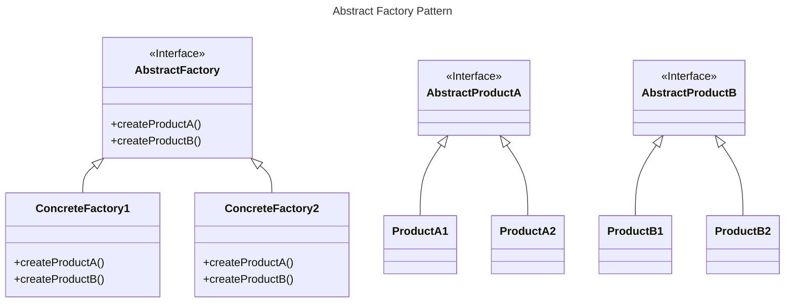
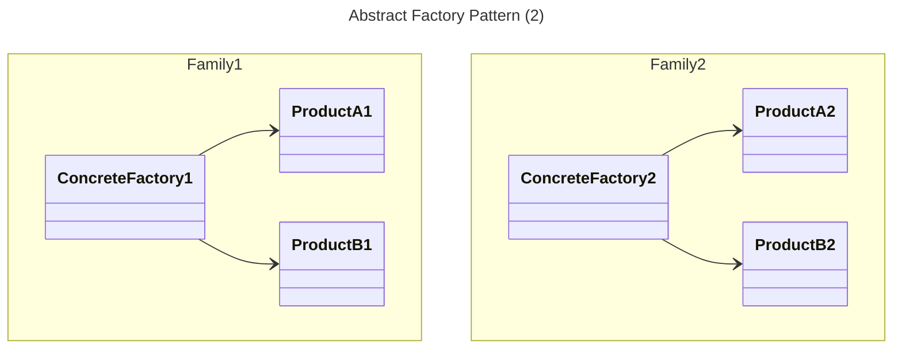
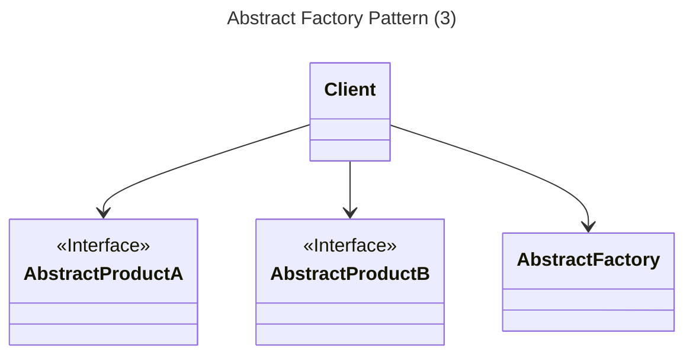
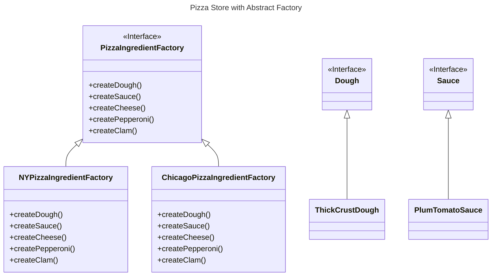

# Abstract Factory

## Overview

The Abstract Factory Pattern provides an interface for creating families of related or dependent objects without specifying their concrete classes.


## Benefits

By writing code that uses the Abstract Factory interface, we decouple our client code from the concrete products that are actually produced.

That allows us to implement a variety of factories that produce products meant for different contexts, such as different regions, operating systems, or styles (look and feels).

We can substitute different factories to get different products and behaviors but still keep the client code stays the same.


## Class Diagram



The Abstract Factory defines the interface that all Concrete factories must implement, which consists of a set of methods for producing products.

The job of an Abstract Factory is to define an interface for creating a set of products. Each method in that interface is responsible for creating a concrete product.

A product family consists of a set of related products with different interfaces (`AbstractProductA`, `AbstractProductB`).

Each concrete factory produces concrete products for a specific product family.



To create a product, the client uses the abstract factory. The  concrete factory is composed and pass to client at runtime. The client works with products through product interfaces.




## Example

There're pizza franchises are located in different regions. 

All regions make up ingredient families, with each region implementing a complete family of ingredient

A ingredient family consists of one dough, one sauce, one cheese, veggies, a pepperoni, a clam.

Now we're going to build a factory to create our ingredients; the factory will be responsible for creating each ingredient in the ingredient family.

In other words, the factory will need to create dough, sauce, cheese, and so on...

Let's start by defining an interface for the factory that is going to create all our ingredients:

```ts
interface PizzaIngredientFactory {
  createDough(): Dough;
  createSauce(): Sauce;
  createCheese(): Cheese;
  createVeggies(): Veggies[];
  createPepperoni(): Pepperoni;
  createClam(): Clams;
}
```

With that interface, we'll build a factory for each region. Each factory will implement the `PizzaIngredientFactory` interface:
```tsx
class NYPizzaIngredientFactory implements PizzaIngredientFactory {
  createDough(): Dough {
    return new ThinCrustDough();
  }

  createSauce(): Sauce {
    return new MarinaraSauce();
  }

  createCheese(): Cheese {
    return new ReggianoCheese();
  }

  createVeggies(): Veggies[] {
    const veggies: Veggies[] = [new Garlic(), new Onion(), new Mushroom(), new RedPepper()];
    return veggies;
  }

  createPepperoni(): Pepperoni {
    return new SlicedPepperoni();
  }

  createClam(): Clams {
    return new FreshClams();
  }
}
```

For our regional Pizza Store, we also need to give them a reference to their local ingredient factories:

```ts
class NYPizzaStore extends PizzaStore {
  public createIngredients() {
    const ingredientFactory: PizzaIngredientFactory = new NYPizzaIngredientFactory();

    dough = ingredientFactory.createDough();
    sauce = ingredientFactory.createSauce();
    cheese = ingredientFactory.createCheese();
    clam = ingredientFactory.createClam();
  }
}
```




## Compare with Factory Method

Factory Methods are a natural way to implement product methods (`createProductA`, `createProductB`) in abstract factories. Each method is declared abstract and the subclasses override it to create some object.

Both are used to decouple applications from specific implementations, but in different ways.

**Factory Method**:
- Uses inheritance to decouple client code from concrete type.
- Provides an interface for creating one product.
- Subclasses implement the factory method to create one product.
- Subclasses inherit methods make use of product from the abstract creator.
- Client instantiates a subclass and use it directly.
- Use when you want to decouple your client code from the concrete classes you need to instantiate

**Abstract Factory**:
- Uses object composition to decouple client code from concrete type.
- Provides an interface for creating a family of products.
- Subclasses implement multiple methods to create a set of related products.
- Subclasses only have methods to create products.
- Client instantiates a subclass to create products, then pass products into some code that is make use of them.
- Adding new type of product require changing the interface.
- Use when you have families of products you need to create.
