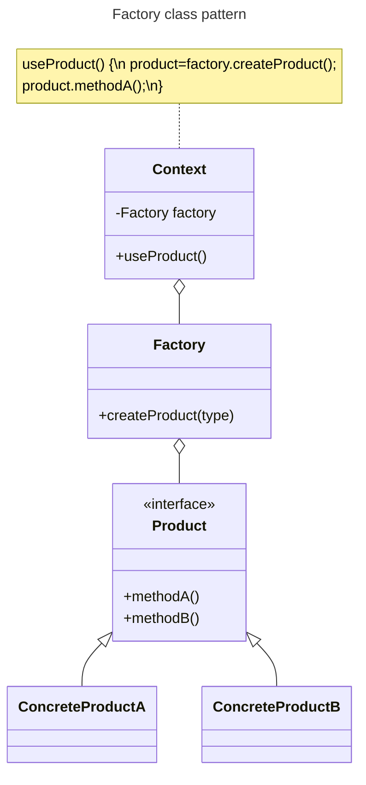

# Factory Pattern

## Overview

The Factory pattern encapsulates object creation by extracting instantiation code from the client into a separate class.

It helps decoupling client code from concrete classes (implementation).

Tying your code to concrete classes can make it more fragile and less flexible.

Dealing with which concrete class is instantiated is really messing up our code and preventing it from being **closed for modification**.

By encapsulating the object creating in one class, we now have only one place to make modifications when the implementation changes.

While it isn't officially a Design Pattern, it is commonly used.


## Class Diagram



The `Factory` class:
- responsible for object creation
- it should be the only part of the application that references concrete classes
- has a factory method `createProduct()`, which may be parameterized, to create various product variations.

The `Product` interface defines methods required by clients.

Each concrete product implements the `Product` interface. It's created by `Factory`, and returned to the client.

`Context` is the client of the factory. It goes through a `Factory` object to get instances of `Product`.


## Example

Suppose you run a pizza shop with a `PizzaStore` class.

The class contains an `orderPizza()` method that handles ordering of pizza. It determines which type of pizza to serve and then makes the pizza:
```tsx
class PizzaStore {
  orderPizza(type: string): Pizza {
    let pizza: Pizza;

    // This is what varies. As the pizza selection changes over time,
    // you’ll have to modify this code over and over.
    if (type === "cheese") {
      pizza = new CheesePizza();
    } else if (type === "greek") {
      pizza = new GreekPizza();
    } else if (type === "pepperoni") {
      pizza = new PepperoniPizza();
    } else {
      throw new Error('unsupported pizza type')
    }

    pizza.prepare();
    pizza.bake();
    pizza.cut();
    pizza.box();
    return pizza;
  }
}
```

In the method, we have several concrete classes being instantiated, and the decision of which to instantiate is made at runtime.

### Problem

Frequently, the pizza object is used in several parts of the application, leading to duplicated instantiation code, making maintenance and updates more difficult and error-prone when the logic of pizza offerings change.

Also, the code makes use of concrete classes like `CheesePizza`, `GreekPizza` may have to be changed as new concrete classes are added. This means your code won't be "**closed for modification**" as you'll need to reopen it to extend with new types.


### Solution

We move the part that creates objects out of our code, into another class, `SimplePizzaFactory`:

```ts
class SimplePizzaFactory {
  createPizza(type: string): Pizza {
    let pizza: Pizza;
    if (type === "cheese") {
      pizza = new CheesePizza();
    } else if (type === "pepperoni") {
      pizza = new PepperoniPizza();
    } else if (type === "clam") {
      pizza = new ClamPizza();
    } else if (type === "veggie") {
      pizza = new VeggiePizza();
    } else {
      throw new Error('unsupported pizza type')
    }
    return pizza;
  }
}
```

`SimplePizzaFactory` handle the details of object creation.

`PizzaStore` becomes a client of that factory. It just cares that it needs an object that implements the `Pizza` interface, then use that object to create a pizza:

```ts
class PizzaStore {
  private factory: SimplePizzaFactory;

  constructor(factory: SimplePizzaFactory) {
      this.factory = factory;
  }

  orderPizza(type: string): Pizza {
      const pizza: Pizza = this.factory.createPizza(type);

      pizza.prepare();
      pizza.bake();
      pizza.cut();
      pizza.box();

      return pizza;
  }
}
```

It looks like we're just pushing the problem off to the Factory object. But the Factory may have many clients that handle the object in a different way than our `PizzaStore`.

By encapsulating the pizza creating in one class, we now have only one place to make modifications when the implementation changes.

By using `Pizza` interface, the `PizzaStore` will work with any new classes implementing that interface through polymorphism.

We’re also just about to remove the concrete instantiations from our client code.


### How about defining a factory as a static method?

BY using static method, you don’t need to instantiate an Factory object to make use of the `create()` method.

But it also has the disadvantage that you can’t subclass and change the behavior of the create method.