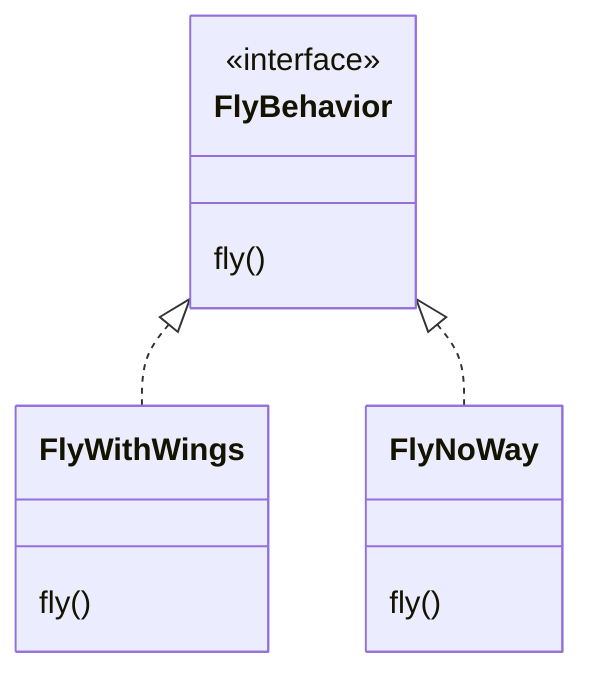
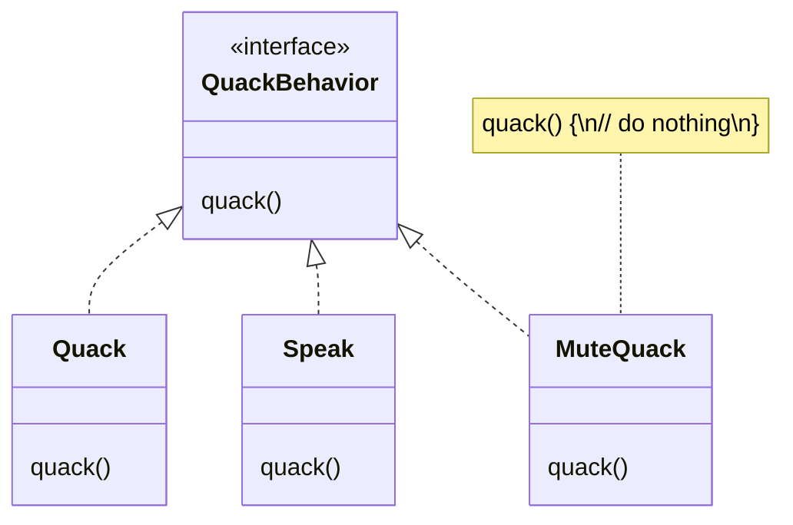

# Design Principles

## Separate changes

***Identify the aspects of your application that vary and separate
them from what stays the same.***

Separate the parts that often change or vary, encapsulate them, so that later you can alter or extend them without affecting those that don’t.

**Do I always have to implement my application first?**
- Not always, when you are designing an application, you anticipate those areas that are going to vary and then go ahead to encapsulate them.

### Example

The `fly()` and `quack()` methods are the parts of the `Duck` class that vary across ducks:
- `RubberDuck` doesn't fly.
- `DecoyDuck` doesn't fly or quack.

To separate "parts that change", we are going to create two sets of classes, one for `fly` and one for `quack`.

Each set of classes will hold all the implementations of the respective behavior.

We’ll use an interface to represent each behavior: `FlyBehavior` and `QuackBehavior`. Each implementation of a behavior will implement one of those interfaces.






## Program to interfaces

***Program to an interface, not an implementation***.

This design principle encourages writting code that rely on abstractions (interfaces) rather than concrete implementations (classes).

### Benefits

**Clearer Contracts**: Interfaces define clear contracts for what are expected, making the code more understandable and self-documenting.

**Maintainability**: Code that depends on interfaces is generally easier to maintain. Changes in one part of the system are less likely to affect other parts.

**Testability**: Interfaces make it easier to write unit tests. You can create mock implementations of the interface to test the function in isolation.

**Decoupling**: By depending on an interface, the function is decoupled from the specific implementation. This reduces dependencies and makes the code more modular.

Let's say your code depends on a class (instead of an interface):
- When that class changes, you need to review every change (methods and attributes) to see if you're referencing them in your code; then, possibly, a refactor is required.
- You're forced to use instances of that class or its subclasses in your code, which reduces flexibility

### Example

We have a function `makePayment` that process payments from users, it need a payment processor to work:
```ts
interface PaymentProcessor {
  processPayment(amount: number): void;
}

function makePayment(processor: PaymentProcessor, amount: number): void {
  processor.processPayment(amount);
}
```

There can be many concrete implementations of the `PaymentProcessor` interface, but the developer working on the `makePayment` function only cares about the methods from the interface.
```tsx
class PayPalProcessor implements PaymentProcessor {
  processPayment(amount: number): void {
    // ...
  }

  // other attributes/methods ...
}

class StripeProcessor implements PaymentProcessor {
  processPayment(amount: number): void {
    // ...
  }

  // other attributes/methods ...
}

// Usage
const paypalProcessor = new PayPalProcessor();
const stripeProcessor = new StripeProcessor();

makePayment(paypalProcessor, 100);
makePayment(stripeProcessor, 100);
```
