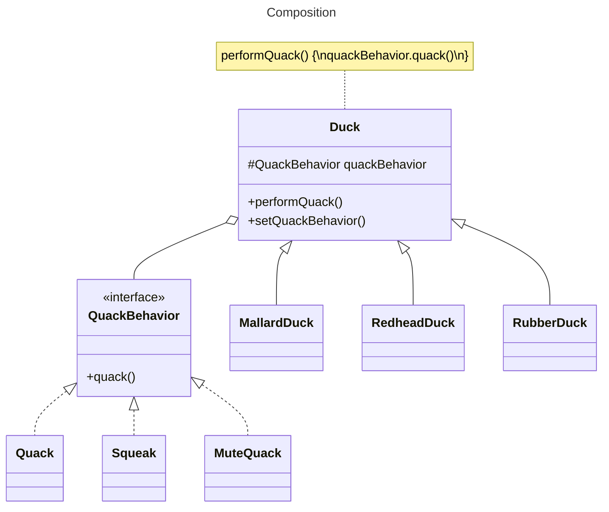

# Favor composition over inheritance

## The power of Composition

If we rely on inheritance, then our behavior can only be determined statically at compile time. In other words, we get only whatever behavior the superclass gives us or that we override.

It is possible to add new responsibilities to objects through composition, including those not designed in the superclass. This avoids modifying its code, reducing the risk of bugs or side effects in existing code.

Composition and delegation can often be used to add new behaviors at runtime.

Instead of inheriting a behavior from a superclass, each class composes the right behavior object.

## Example

We have some Duck classes that have a `quack()` behavior: `MallardDuck`, `RedheadDuck`, `RubberDuck`.

Instead of implementing the `quack()` behavior in the superclass `Duck`, each duck composes its own `QuackBehavior` object.

## Benefits

Creating systems using composition gives you a lot more flexibility:
- Allows you to encapsulate a family of algorithms into their own set of classes
- Lets you extend an object's behavior at runtime.

Allows the implementation of the behavior to vary across classes while still enabling code reuse for classes with the same behavior.
