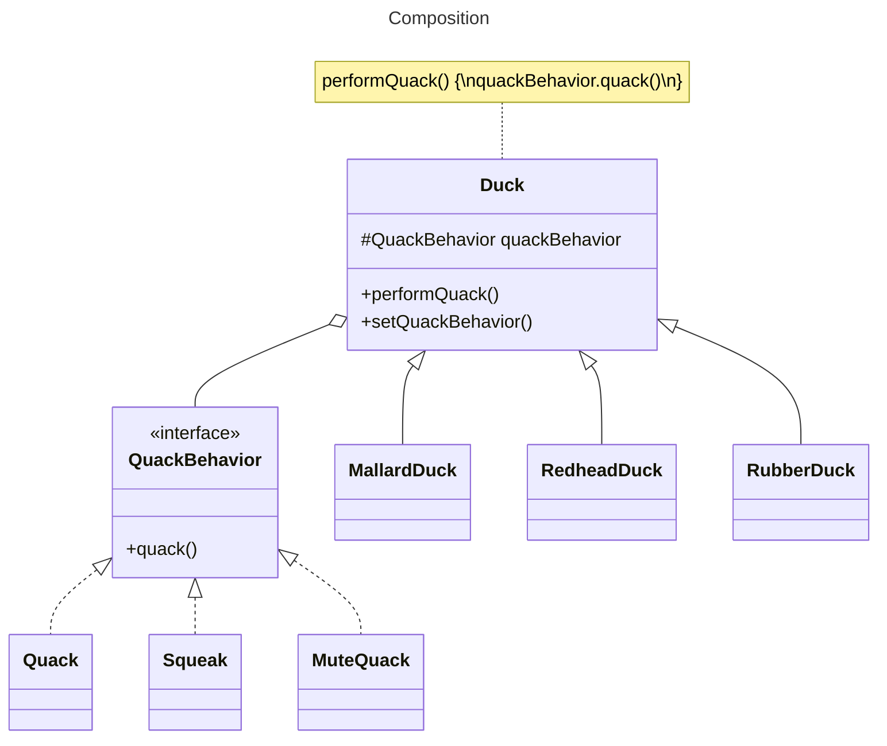

# Favor composition over inheritance

## Overview

Instead of inheriting a behavior from a superclass, each class composes the right behavior object.

## Example

We have some Duck classes that have a `quack()` behavior: `MallardDuck`, `RedheadDuck`, `RubberDuck`.

Instead of implementing the `quack()` behavior in the superclass `Duck`, each duck composes its own `QuackBehavior` object.

## Benefits

Creating systems using composition gives you a lot more flexibility:
- Allows you to encapsulate a family of algorithms into their own set of classes
- Lets you change behavior at runtime (by providing a setter method for the composed behavior)

Allows the implementation of the behavior to vary across classes while still enabling code reuse for classes with the same behavior.
