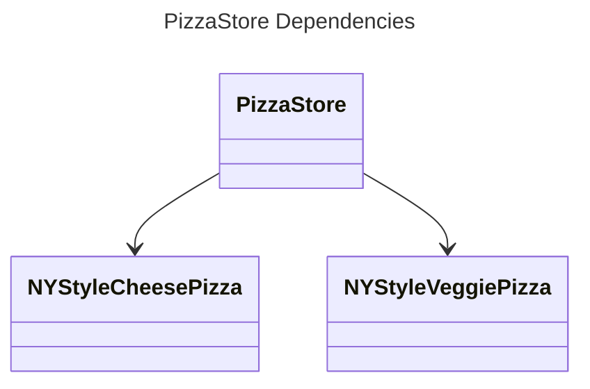
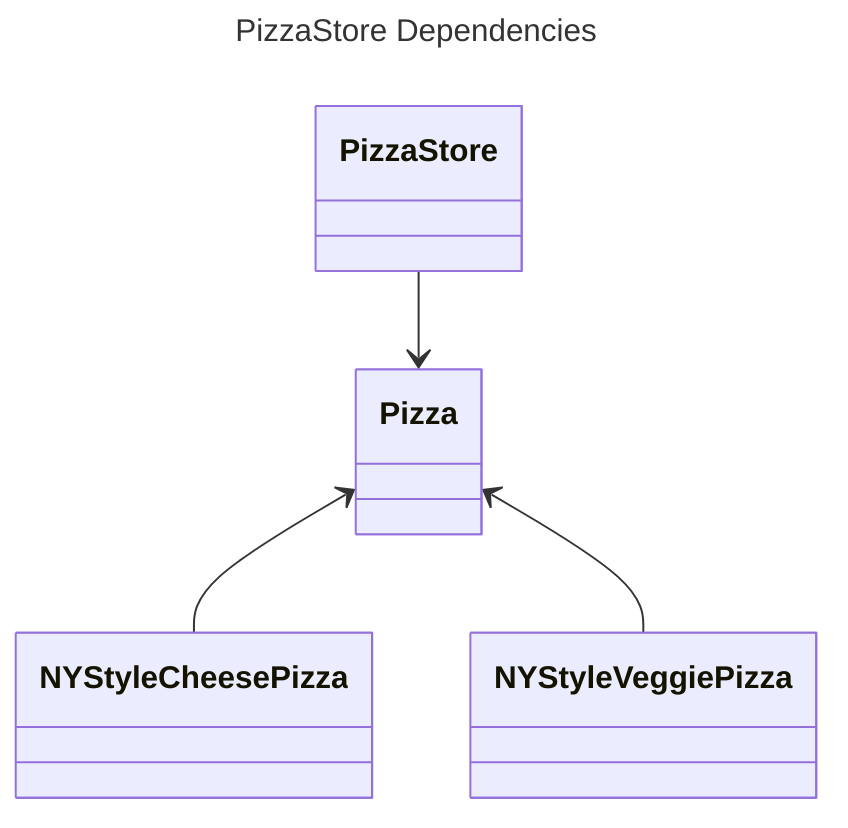

#  Dependency Inversion Principle

## Overview

Depend upon abstractions. Do not depend upon concrete classes.

It suggests that high-level components should not depend on our low-level components, both should depend on abstractions.


## High-Level Component

A high-level component represents complex business logic or application behavior.

It typically orchestrates interactions between other components.

Examples:
- **Service Layer**: Handles business logic, validation, and coordination.
- **Controller (in MVC)**: Manages user input, invokes services, and prepares data for views.
- **Use Case Classes**: Represent specific application use cases.


## Low-Level Component

A low-level component deals with specific technical details or basic operations.

It's often reusable and focused on a single responsibility.

Examples:
- **Data Access Layer (DAL)**: Interacts with databases or external APIs.
- **Utility Classes**: Provide common functionality (e.g., string manipulation, date formatting).
- **Infrastructure Components**: Wrappers for external services (e.g., AWS SDK, HTTP clients).


## Inversion

The term "inversion" refers to a shift in the traditional top-to-bottom dependency relationships between high-level and low-level components. 

Now, the top-to-bottom dependency has inverted itself, with both high-level and low-level modules now depending on the abstraction.

By doing so, we achieve loose coupling and greater flexibility in our codebase.


## Example

We have a `PizzaStore` class with a `createPizza()` method that's responsible for making pizza:
```ts
class PizzaStore {
  createPizza(region: string, type: string): Pizza | null {
    let pizza: Pizza | null = null;
    if (region === "NY") {
      if (type === "cheese") {
        pizza = new NYStyleCheesePizza();
      } else if (type === "veggie") {
        pizza = new NYStyleVeggiePizza();
      } else if (type === "clam") {
        pizza = new NYStyleClamPizza();
      } else if (type === "pepperoni") {
        pizza = new NYStylePepperoniPizza();
      }
    } else if (region === "Chicago") {
      if (type === "cheese") {
        pizza = new ChicagoStyleCheesePizza();
      } else if (type === "veggie") {
        pizza = new ChicagoStyleVeggiePizza();
      } else if (type === "clam") {
        pizza = new ChicagoStyleClamPizza();
      } else if (type === "pepperoni") {
        pizza = new ChicagoStylePepperoniPizza();
      }
    } else {
      console.log("Error: invalid region of pizza");
    }
    
    if (pizza) {
      pizza.prepare();
      pizza.bake();
      pizza.cut();
      pizza.box();
    }
    return pizza;
  }
}
```

If we draw a diagram representing the `PizzaStore` and all the objects it depends on:



The main problem with the `PizzaStore` is that it depends on every type of pizza because it actually instantiates concrete types in its `orderPizza()` method.

To get those instantiations out of the `orderPizza()` method, we apply the Factory Method Pattern. Then, our diagram looks like this:



After applying Factory Method, you’ll notice that our high-level component, the `PizzaStore`, and our low-level components, the pizzas, both depend on `Pizza`, the abstraction.