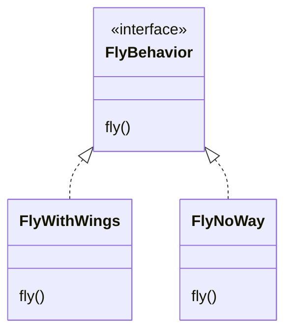
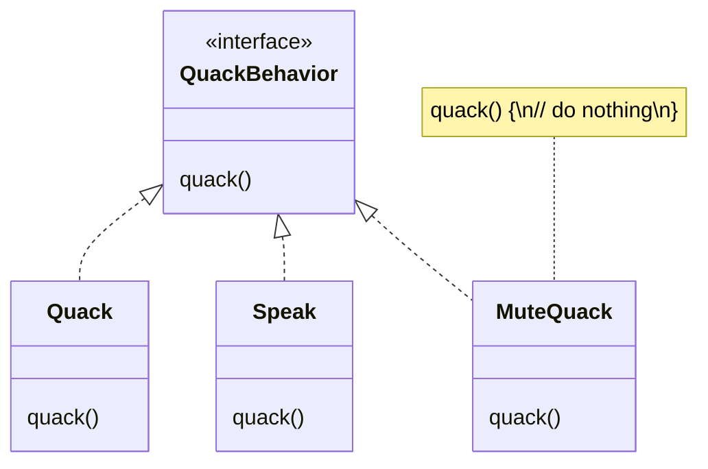

# Encapsulate changes

## Overview

***Identify the aspects of your application that vary and separate
them from what stays the same.***

Separate the parts that often change/vary, encapsulate them, so that later you can alter or extend them without affecting those that don’t.

**Do I always have to implement my application first?**
- Not always, when you are designing an application, you anticipate those areas that are going to vary and then go ahead to encapsulate them.

## Example

The `fly()` and `quack()` methods are the parts of the `Duck` class that vary across subclass ducks:
- `RubberDuck` doesn't fly.
- `DecoyDuck` doesn't fly or quack.

To separate "parts that change", we are going to create two sets of classes, one for `fly` and one for `quack`.

Each set of classes will hold all the implementations of the respective behavior.

We’ll use interfaces to represent each behavior: `FlyBehavior` and `QuackBehavior`. Each implementation of a behavior will implement one of those interfaces.

