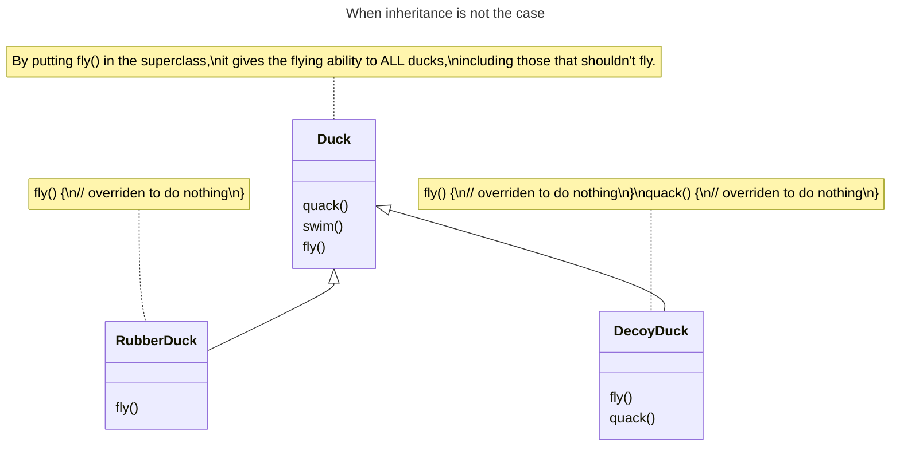

# Inheritance

## Benefits

Code reusability: by creating a new class (child class) that inherits attributes and methods from an existing class (parent class), you can avoid duplicating code

Modularity: a hierarchy of classes makes it easier to manage and understand the code, as related functionalities are grouped together.

Extensibility: easier to extend existing code. You can add new features or modify existing ones in the child class without altering the parent class

Maintainability: any changes or bug fixes of common functionalities in the parent class need to be made only once, reducing the risk of errors and making the code easier to maintain.

Polymorphism: allowing you to use a child class object wherever a parent class object is expected

## Disadvantages

### Complex Hierarchies

Complex class hierarchies that are difficult to understand and manage.

As the hierarchy grows, it becomes harder to trace the flow of the program and understand the relationships between classes.

### Tight Coupling

Changes in the parent class can have unintended effects on the child classes, making the code harder to maintain.

Inheritance enforces a rigid structure. Once a class hierarchy is established, it can be challenging to make changes without affecting the entire hierarchy.

## When not to use?

Inheritance should not be used when:
- Code reuse is not achievable. For example: behaviors keeps changing across subclasses
- Behaviors of some classes are different with the others
- It's not appropriate for all subclasses to have a behavior

When a behavior is inapproriate for subclasses, it can be  overriden(e.g., to do *nothing*), but it leads to:
- hard to gain knowledge of all class behaviors: *which class support the behavior or not?*
- we'll be forced to look at every new subclass and possibly override new behavior
- code is duplicated accross subclasses

For example, with the `Duck` superclass:
- `RubberDuck` doesn't support `fly()`
- `DecoyDuck` doesn't support `fly()` or `quack()`

