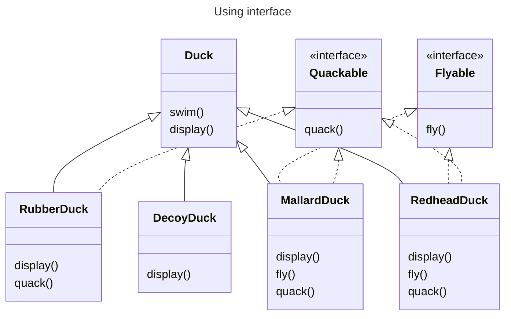

# Interface

## Benefits

### Define clear contracts

By making your code depends on interfaces, you define exactly what are expected, minimize the time and effort needed to understand the code.

### Make code more understandable

Interfaces can be used to gain knowledge of class's behaviors. Knowing which interfaces a class implements, we can get the desired behaviors for that class.

