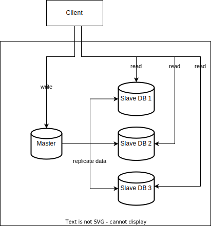

# Database replication

## Overview

Database replication involves creating copies of a database and storing them on multiple servers.

A master database generally only supports write operations.  All the data-modifying commands like insert, delete, or update must be sent to the master database. A slave database gets copies of the data from the master database and only supports read operations.

Most applications require a much higher ratio of reads to writes. Thus, the number of slave databases in a system is usually larger than the number of master databases.

## Advantages

- **Better performance**. This allows more queries to be processed in parallel across slave nodes
- **Reliability**. Since data is replicated across multiple locations, when a disaster happens on one of the database servers, data is still preserved.
- **High availability**: your website remains in operation even if a database is offline as you can access data stored in another database server.

## Failover

When one of the database servers goes offline:
- If only one slave database is available and it goes offline, read operations will be directed to the master database temporarily. In case multiple slave databases are available, read operations are redirected to other healthy slave databases.
- If the master database goes offline, a slave database will be promoted to be the new master. In production systems, promoting a new master is more complicated as the data in a slave database might not be up to date. The missing data needs to be updated by running data recovery scripts. Although some other replication methods like multi-masters and circular replication could help, those setups are more complicated;