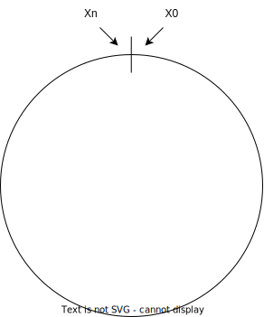
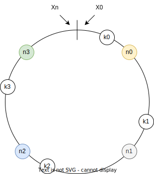
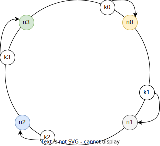
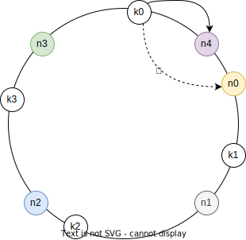

# Consistent Hashing

## Overview

Consistent hashing is a special kind of hashing technique to distribute data across multiple nodes in a way that minimizes data movement when nodes are added or removed.

On average, when a hash table is resized, only `k/m` keys is remapped:
- `k`: the number of keys
- `m`: the number of nodes

In a sharded database, consistent hashing can be used to determine which shard a particular piece of data should go to. This helps in evenly distributing the data across all shards.

## How it works

### Hash ring
We have a hash function that takes a string and returns a hashed value (e.g., MD5, SHA-1).

The hash space is defined by the output range of the hash function, from $x_0$ to $x_n$. This space is typically represented as a ring (hash ring).

### Position
Both the nodes (servers) and the data (keys) are hashed using the hash function. It maps them to positions on the hash ring.

*In above figure, we have nodes $n_0$, $n_1$, $n_2$, $n_3$ and keys $k_0$, $k_1$, $k_2$, $k_3$ are hashed and mapped to the hash ring.*

### Data distribution
When a data item needs to be stored, it is hashed to a position on the ring. The data item is then assigned to the first node that appears clockwise from its position on the ring.

*In above figure, $k_0$ belong to $n_0$, $k_1$ belong to $n_1$, $k_2$ belong to $n_2$, $k_3$ belong to $n_3$.*

### Adding Node
When a new node is added, it is assigned a position on the hash ring based on its hash value. Only the data between the new node and the preceding node needs to be redistributed.

*In above figure, when $n_4$ is inserted between $n_3$ and $n_0$, only keys between $n_3$ and $n_4$ are redistributed: $k_0$ is now belong to $n_4$, not $n_0$.*

### Removing Node
When a node is removed, items belong to that node are redistributed to the next node on the ring.

*In above figure, when $n_1$ is removed, $k_1$ is redistributed to $n_2$.*
