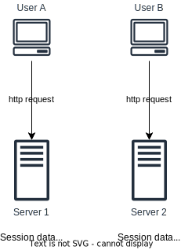

# Load balancer

## Overview

A load balancer evenly distributes incoming traffic among servers that are defined in a load-balanced set.

A load balancer communicates with servers through private IPs. A private IP is an IP address reachable only between servers in the same network; however, it is unreachable over the internet.

Servers are unreachable directly by clients anymore.

## High available for load balancer

Load balancers can become a Single Point of Failure (SPOF) if it lacks redundancy. 

To mitigate this risk, load balancers are often deployed in a highly available configuration. This involves using multiple load balancers in a cluster and configuring them to automatically fail over to a backup load balancer in the event of a failure.

For example, AWS Load Balancers are deployed across multiple Availability Zones within a region, ensuring that even if one AZ experiences an issue, the load balancer can continue to operate and distribute traffic to healthy targets in other AZs.

## Stateful architecture

A stateful server remembers client data (state) from one request to the next. The client's state is stored locally on the server.

Stateful architecture require every request from the same client must be routed to the same server.

In above figure, user A's session data is stored in Server 1. To authenticate User A, HTTP requests must be routed to Server 1. If a request is sent to other servers like Server 2, authentication would fail because Server 2 does not contain User A's session data.

### Sticky sessions

Most load balancers support sticky sessions, which allow requests from a particular client to be consistently routed to the same server. However:
- This adds the overhead to the load balancer to track and maintain session affinity
- It's hard to scale horizontally. Adding or removing servers is much more difficult
- It is challenging to handle server failures
- If a server goes down, all active sessions on that server are lost
- It can lead to uneven load distribution. If one server receives a disproportionate number of sessions, it can become a bottleneck, while other servers remain underutilized

## Stateless architecture

Stateless architecture refers to a design where each request from a client to the server is treated as an independent transaction that is unrelated to any previous request.

State data is stored in a shared data store and kept out of web servers.

Each request contains all the information the server needs to fulfill it. Requests from a client can be sent to any of the servers.

### Benefits

Simplified Server Design. Servers are simpler to design and manage because they do not need to handle session state.

Improved Scalability. Stateless servers can be easily scaled out to handle more requests, as there is no need to synchronize session state across servers.

Fault Tolerance. If a server fails, another server can handle the request without any loss of session data.

Ease of Maintenance. Stateless systems are easier to maintain and debug because each request is independent and self-contained.

Better Performance. Reduced overhead from managing session state can lead to better performance and faster response times.

### Use cases

- **RESTful APIs**: REST is a popular architectural style for designing networked applications, and it relies on stateless communication.
- **Microservices**: Stateless architecture is often used in microservices to ensure that each service can operate independently and scale efficiently.
- **Serverless Computing**: Platforms like AWS Lambda and Azure Functions are inherently stateless, allowing for automatic scaling and efficient resource utilization.
