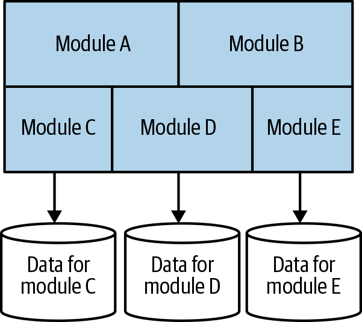

# The Monolith Architecture

When all functionality in a system must be deployed together, I consider it a monolith.

## The Single-Process Monolith

A single-process monolith is a system where all of the code is deployed as a single process

You may have multiple instances of this process for robustness or scaling reasons, but fundamentally all the code is packed into a single process.

This single-process monolith can be simple distributed systems because they interact with databases and present information to web or mobile applications

Monoliths can be more complex than just a single process, with multiple tightly coupled monoliths or vendor software involved

The classic single-process monolithic deployment can make sense for smaller organizations

## The Modular Monolith

As the organization grows, the monolith can potentially grow with it, leading to the concept of a modular monolith.

The modular monolith is a variation of the single-process monolith where the single process consists of separate modules.

Each module can be worked on independently, but all modules still need to be combined together for deployment.

The modular monolith can be a good choice for organizations if module boundaries are well defined, allowing for parallel work and simpler deployment topology compared to microservice architecture.

> Shopify is an example of an organization that successfully uses the modular monolith approach instead of microservices

One challenge of the modular monolith is that the database tends to lack decomposition, which could pose difficulties if you want to pull apart the monolith in the future.

Some teams attempt to address this challenge by decomposing the database along the same lines as the modules.

## The Distributed Monolith

A distributed monolith is a system that consists of multiple services but must be deployed together.

A distributed monolith may meet the definition of a Service-Oriented Architecture (SOA), but often fails to deliver the promised benefits of SOA.

Distributed monoliths have the disadvantages of both a distributed system and a single-process monolith, without enough of the advantages of either.

Distributed monoliths typically arise from architectures that lack focus on concepts like information hiding and cohesion of business functionality.

Highly coupled architectures in distributed monoliths cause changes to ripple across service boundaries and seemingly local changes can break other parts of the system.

## Problem of Monoliths (Delivery Contention)

Working in the same place can lead to issues such as conflicting code changes and differing deployment schedules.

Confusion around ownership and decision-making can arise when multiple teams are involved.

**Delivery contention** refers to the challenges caused by these issues.

Having a monolith or microservice architecture does not guarantee the presence or absence of delivery contention.

However, a microservice architecture provides more concrete boundaries for ownership, offering greater flexibility in reducing this problem.

## Advantages of Monoliths

Monoliths, such as single-process or modular monoliths, have advantages like simpler deployment topology and avoiding pitfalls of distributed systems.

Monoliths simplify developer workflows and activities like monitoring, troubleshooting, and end-to-end testing.

Code reuse is easier within a monolith compared to a distributed system.

A monolithic architecture is a valid and sensible default choice as an architectural style.