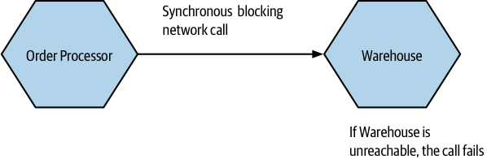
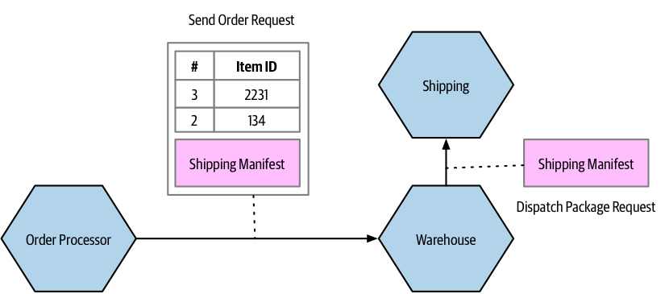
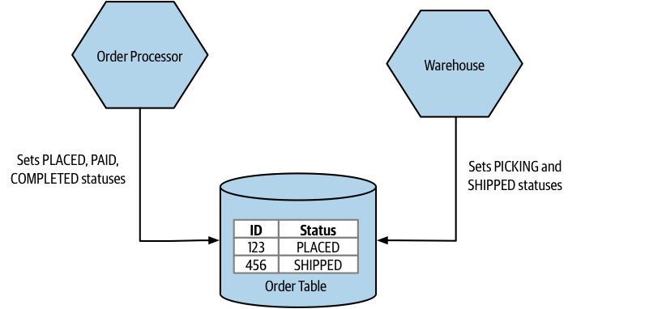
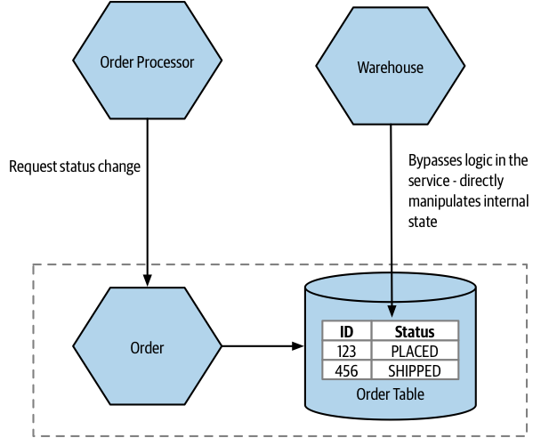

# Types of Coupling

Here are different types of coupling, organized from low (desirable) to high (undesirable):

## Domain Coupling

1. Domain coupling describes a situation in which one microservice needs to interact with another microservice because it requires the functionality provided by the other microservice.
2. In the example shown in Figure 2-2, the Order Processor microservice calls the Warehouse and Payment microservices for reserving stock and taking payment, respectively. The Order Processor microservice is dependent on and coupled to the Warehouse and Payment microservices for this operation.

4. In a microservice architecture, some level of interaction between microservices is unavoidable for collaboration.
5. However, it is desirable to minimize dependencies where a single microservice depends on multiple downstream services, as it may indicate that the microservice is performing too many tasks.
6. Domain coupling is considered a loose form of coupling, but it can still lead to problems if there are excessive dependencies or complex data exchanges between services.
7. Information hiding is important in microservices; only share necessary information and send the minimum amount of data required.

## Temporal coupling

1. Temporal coupling refers to situations in which concepts are bundled together because they happen at the same time.
2. In the context of distributed systems, temporal coupling occurs when one microservice requires another microservice to perform an action simultaneously for the operation to complete.
3. Both microservices need to be up and available at the same time for communication to happen successfully.
4. In Figure 2-3, the MusicCorp's Order Processor makes a synchronous HTTP call to the Warehouse microservice, requiring Warehouse to be accessible during the call. If Warehouse cannot be reached, the operation fails as the CDs cannot be reserved.

6. Temporal coupling can lead to resource contention as the Order Processor may have to wait for a response from Warehouse.
7. Temporal coupling becomes more challenging with more microservices and complex interactions, making it harder to scale and maintain the system.
8. Asynchronous communication, such as using a message broker, can help mitigate temporal coupling.

## Pass-Through Coupling

1. Pass-through coupling occurs when one microservice passes data to another microservice because it is needed by a downstream microservice.
2. Pass-through coupling can be problematic as it requires the caller to know about the microservice being invoked and potentially how the one-step-removed microservice works.
3. Changes to the required data downstream can cause significant upstream changes.

We have an **Order Processor**, which is sending a request to **Warehouse** to prepare an order for dispatch. As part of the request payload, we send along a **Shipping Manifest**. This **Shipping Manifest contains** not only the address of the customer but also the shipping type. The **Warehouse** just passes this manifest on to the downstream **Shipping** microservice.

4. One possible solution is for the calling microservice to bypass the intermediary and communicate directly with the downstream microservice.

In our example, **Order Processor** speaks directly to **Shipping**. However, this causes some other headaches. Our **Order Processor** is increasing its domain coupling, as **Shipping** is yet another microservice it needs to know about—if that was the only issue, this might still be fine, as domain coupling is of course a looser form of coupling.

This solution gets more complex here, though, as stock has to be reserved with **Warehouse** before we dispatch the package using **Shipping**, and after the shipping has been done we need to update the stock accordingly. This pushes more complexity and logic into **Order Processor** that was previously hidden inside **Warehouse**.

5. Another solution is to hide the requirement for certain data from the calling microservice by having an intermediary microservice handle the data construction locally.

For this specific example, I might consider a simpler change, to totally hide the requirement for a **Shipping Manifest** from **Order Processor**. The idea is delegate the work of both managing stock and arranging for dispatch of the package to our **Warehouse** service.

**Warehouse** take in the required information as part of its contract, and then have it construct the **Shipping Manifest** locally. This means that if the **Shipping** service changes its service contract, this change will be invisible from the viewpoint of **Order Processor**, as long as **Warehouse** collects the required data.

6. One final approach to reducing pass-through coupling is for the intermediary microservice to forward the data without processing or understanding its structure. Changes in the format of the data still require changes to both the calling microservice and the downstream microservice, but the intermediary microservice doesn't need to change.

**Order Processor** still send the **Shipping Manifest** to the **Shipping** microservice via the **Warehouse**, but to have the **Warehouse** be totally unaware of the structure of the **Shipping Manifest** itself. The **Order Processor** sends the manifest as part of the order request, but the **Warehouse** makes no attempt to look at or process the field. Instead, it just sends it along.

A change in the format of the the **Shipping Manifest** would still require a change to both the **Order Processor** and the **Shipping** microservice, but as the **Warehouse** doesn’t care about what is actually in the manifest, it doesn’t need to change.

## Common Coupling

- Common coupling occurs when two or more microservices make use of a common set of data.
- Changes to the structure of the data can impact multiple microservices at once.
- Common coupling becomes more problematic if the structure of the common data changes frequently or if multiple microservices are reading and writing to the same data.

In this example, **Order Processor** and **Warehouse** service are both reading and writing from a shared `Order` table to help manage the process of dispatching products to customers. Both microservices are updating the `Status` column. The **Order Processor** can set the `PLACED`, `PAID`, and `COMPLETED` statuses, whereas the **Warehouse** will apply `PICKING` or `SHIPPED` statuses.

When making changes in **Order Processor**, can I be sure that I am not changing the order data in such a way that it breaks **Warehouse**’s view of the world, or vice versa?

One way to ensure that the state of something is changed in a correct fashion would be to create a finite state machine. A state machine can be used to manage the transition of some entity from one state to another, ensuring invalid state transitions are prohibited.

The problem in this specific example is that both **Warehouse** and **Order Processor** share responsibilities for managing this state machine. How do we ensure that they are in agreement as to what transitions are allowed?

Managing processes like state transitions across microservice boundaries can be done using sagas.

A potential solution here would be to ensure that a **single microservice manages the order state**. So either **Warehouse** or **Order Processor** can send status update requests to the **Order** service. Here, the **Order** microservice is the source of truth for any given order.

If the **Order** service received a request from **Order Processor** to move a status straight from `PLACED` to `COMPLETED`, it is free to reject that request if that is an invalid change.

- Sources of common coupling can also be sources of resource contention, potentially causing problems if the shared resource becomes slow or unavailable.
- Common coupling limits the changes that can be made to shared data and can indicate a lack of cohesion in code.
- So common coupling is sometimes OK, but often it’s not. It is one of the least desirable forms of coupling, but it can get worse.

## Content Coupling

- Content coupling occurs when an upstream service reaches into the internals of a downstream service and changes its internal state.
- The most common manifestation of this is an external service accessing another microservice’s database and changing it directly.
- Common coupling and content coupling both involve two or more microservices reading and writing to the same set of data, but with common coupling, the shared dependency is understood to be external and not under your control.
- In content coupling, the lines of ownership become less clear and it becomes more difficult for developers to change a system.
- Problems that occur with common coupling also apply with content coupling, but content coupling has some additional headaches that make it problematic enough that some people refer to it as pathological coupling.
- Content coupling can lead to duplication of logic and confusion in the system's state.
- Internal data structures are exposed to outside parties, making subsequent changes more difficult and increasing the risk of breaking upstream consumers.
- Allowing direct access to the database by an outside party eliminates information hiding and makes it difficult to define what can or cannot be changed.
- In short, avoid content coupling.

In the previous example, we have an Order service that is supposed to manage the allowable state changes to orders in our system.

The Order Processor is sending requests to the Order service. On the other hand, the Warehouse service is directly updating the table in which order data is stored, bypassing any functionality in the Order service that might check for allowable changes.

We have to hope that the Warehouse service has a consistent set of logic to ensure that only valid changes are made. At best, this represents a duplication of logic. In the worst case, the checking around allowable changes in Warehouse is different from that in the Order service, and as a result we could end up with orders in very odd, confusing states.

When changing the Order service, we now have to be extremely careful about making changes to that particular table, it’s obvious to us that this table is being directly accessed by an outside party.

The easy fix here is to have the **Warehouse** send requests to the **Order** service itself, where we can vet the request but also hide the internal detail, making subsequent changes to the Order service much easier.