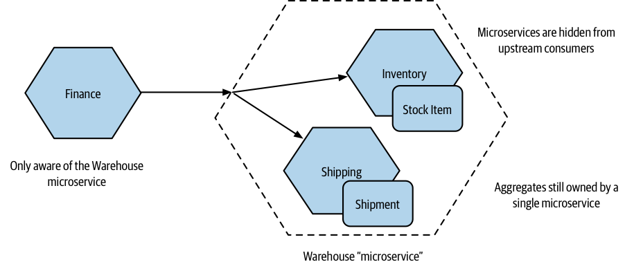

# Domain-Driven Design (in short)

The primary mechanism we use for finding microservice boundaries is around the domain itself, making use of domain-driven design (DDD) to help create a model of our domain.

Core concepts of DDD:

- **Ubiquitous language**: Defining and adopting a common language to be used in code and in describing the domain, to aid communication.
- **Aggregate**: A collection of objects that are managed as a single entity, typically referring to real-world concepts.
- **Bounded context**: An explicit boundary within a business domain that provides functionality to the wider system but that also hides complexity

## Ubiquitous Language

Ubiquitous language emphasizes the use of the same terms in code as used by users. It helps in modeling the real-world domain and improving communication between the delivery team and users.

When the real-world language was incorporated into the code, it became easier for developers to understand and work on tasks described by the product owner.

> In a counterexample at a global bank, the product owner had deep domain understanding but the code lacked the same language.
>
> A standard data model called "the IBM banking model" was used, which didn't align with the specific system being built for corporate liquidity management.
>
> The codebase lost understanding of the system due to the polluted data model. Business analysts had to constantly translate the rich domain language of the product owner to generic code concepts.

## Aggregate

An aggregate in DDD represents a real domain concept, such as an `Order` or `Invoice`, a `Stock Item`.

Aggregates typically have a life cycle and can be implemented as state machines.

Aggregates should be treated as self-contained units, with code that handles state transitions and the state itself grouped together.

> As an example in the MusicCorp domain, an Order aggregate might contain multiple line items that represent the items in the order. Those line items have meaning only as part of the overall Order aggregate.

One aggregate should be managed by one microservice, although a single microservice typically manages one or more aggregates.

Aggregates can have relationships with other aggregates, which can be stored using foreign keys in a relational database within the same microservice or modeled using explicit references if spanning microservice boundaries.

> We have a Customer aggregate that is associated with one or more Orders and one or more Wishlists. These aggregates could be managed by the same microservice or by different microservices.

Storing references to foreign aggregates using URIs or a pseudo-URI scheme can make relationships more explicit and facilitate cross-microservice aggregate lookups.

> We have changed things to make the relationship explicit. Rather than a vanilla ID for the customer reference, we instead store a URI, which we might use if building a REST-based system.

But what if you aren't building a REST system? a variation of this approach is a pseudo-URI scheme for cross-service references.

> For example, `soundcloud:tracks:123` would be a reference to a track with the ID of `123`. This is much more explicit for a human looking at this identifier, but it is also a useful enough scheme that it would be easy to imagine creating code that could ease cross-microservice aggregate lookups if needed.

Breaking a system into aggregates is subjective and may change over time based on performance or implementation considerations.

The mental model of system users should guide initial design decisions for aggregates.

## Bounded Context

A bounded context represents a larger organizational boundary where explicit responsibilities are carried out.

Bounded contexts hide implementation detail and internal concerns that are not relevant to the outside world.

Bounded contexts contain one or more aggregates, which can be exposed or hidden within the context.

Bounded contexts can have relationships with other bounded contexts, creating inter-service dependencies when mapped to services.

> The domain of MusicCorp includes various parts such as the warehouse and the finance department.
>
> The finance department and the warehouse can be considered separate bounded contexts within the domain.
>
> Each bounded context has an explicit interface to the outside world and internal details that are specific to its operations.
>
> The finance department needs information about stock levels from the warehouse to keep the accounts up to date.

> The shared model between the finance department and the warehouse is the stock item, but it may have different internal and external representations.

> Concepts like the customer can appear in multiple bounded contexts with different meanings and names.
>
> Shared models like the customer may store different information in different bounded contexts.

## Mapping Aggregates and Bounded Contexts to Microservices

The aggregate and the bounded context provide units of cohesion with well-defined interfaces to the wider system.

The aggregate focuses on a single domain concept and acts as a self-contained state machine.

The bounded context represents a collection of associated aggregates and has an explicit interface to the wider world.

Both the aggregate and the bounded context can serve as service boundaries.

When starting out, it is recommended to reduce the number of services and target services that encompass entire bounded contexts. As you gain more experience, you may decide to break these services into smaller services.

It is important to note that aggregates should not be split apart when breaking services into smaller ones. A microservice can manage one or more aggregates, but one aggregate should not be managed by more than one microservice.

### Turtles all the way down

Initially, identify coarse-grained bounded contexts, which can contain further bounded contexts.

Consider decomposing the larger, coarser-grained contexts into smaller nested contexts to gain the benefits of splitting seams.

You can hide the decision to split a service into smaller parts from the outside world by presenting a coarser-grained API to consumers.

> We've split Warehouse down into Inventory and Shipping. As far as the outside world is concerned, there is still just the Warehouse microservice.
>
> Internally though, we've further decomposed things to allow Inventory to manage Stock Items and have Shipping manage Shipments. Remember, we want to keep the ownership of a single aggregate inside a single microservice.

Even if a service is decomposed internally, it can still be perceived as a single microservice by the outside world. The ownership of a single aggregate should remain within a single microservice.

Hiding implementation details in this way ensures that consumers are unaware if the implementation changes in the future.

The nested approach can also simplify testing and provide unit isolation when considering larger-scoped tests.

> For example, when testing services that consume the warehouse, I don't have to stub each service inside the warehouse context—just the more coarse-grained API.
>
>I may, for example, decide to have end-to-end tests in which I launch all services inside the warehouse context, but for all other collaborators I might stub them out.

## The Case for Domain-Driven Design for Microservices

Bounded contexts in DDD explicitly hide information and present clear boundaries to the wider system, allowing internal complexity to change without impacting other parts of the system.

Adopting a DDD approach also means adopting information hiding, which helps find stable microservice boundaries.

The focus on defining a common, ubiquitous language in DDD greatly helps in defining microservice endpoints, APIs, and event formats.

It solves the problem of standardizing APIs while allowing language changes within bounded contexts.

Decomposing systems along bounded contexts allows changes to be isolated to a single microservice boundary, reducing the number of places that need to be changed and enabling quick deployment.

DDD puts the business domain at the center of software development, pulling the language of the business into code and service design.

This improves domain expertise among software developers, enhances understanding and empathy for users, and fosters better communication between technical delivery, product development, and end users.

DDD aligns the technical architecture with the organizational structure, making it compatible with stream-aligned teams and breaking down silos between IT and "the business."