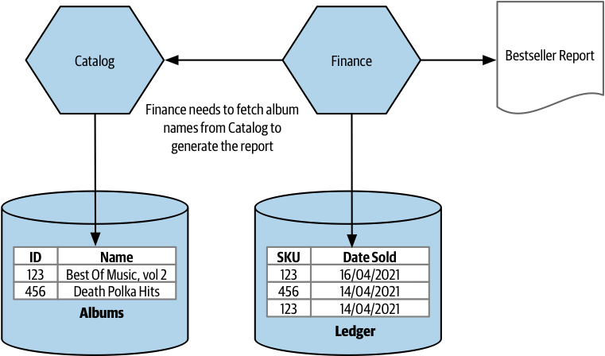

# Data Decomposition Concerns

## Performance

When we split databases apart in the name of microservices, we end up having to move join operations from the data tier (database) up into the microservices themselves. And try as we might, it's unlikely to be as fast.

That's because the microservice has to call other microservices to request information that it doesn't own.

> In the example below, when generating the bestsellers report, the Finance microservice first queries the Ledger table, extracting the list of best-selling SKUs.
> 
> Then, it need to call the Catalog microservice, requesting information on each of these SKUs.
> 
> 
>
> We can mitigate the likely impact of report generating latency by allowing for SKUs to be looked up in the Catalog microservice in bulk, or perhaps even by caching the required album information locally.

## Data Integrity

Databases can be useful in ensuring integrity of our data.

If we define a foreign key relationship between the rows in two tables, we can always navigate from a record in one table back to the referenced table. This is because we cannot delete records from a table if they are referenced in another table.

However, if these tables are now living in different databases, we no longer have enforcement of the integrity of our data model. This means that there is nothing to stop us from deleting a row in a table, which can cause an issue when we try to reference back.

You can no longer rely on your database to enforce the integrity of inter-entity relationships for entities stored in multiple microservice.

There are a number of work-arounds:

- We could use a soft delete so that we don't actually remove a record but just mark it as deleted.
- Another option could be to copy the data to another microservice, but we would have to resolve how we wanted to handle synchronizing changes in that data.

## Transactions

Once we start splitting data across multiple databases, though, we lose the safety of the ACID transactions.

We try to implement **distributed transactions** to regain the guarantees that ACID transactions, but they are not only complex to implement, even when done well, but they also don't actually give us the same guarantees that we came to expect with more narrowly scoped database transactions.

## Tooling

Changing databases is difficult because of limited tools available to make changes easily. Refactoring tooling is built into IDEs for code, but not for databases.

With databases, they have state, and we lack good refactoring-type tooling.

There are many tools to help manage the process of changing the schema of a relational database. Each schema change is defined in a version-controlled delta script. These scripts are then run in strict order in an idempotent manner.

## Reporting Database

When extracting microservices from monolithic application,databases are also broken apart to hide access to internal data storage.

Hiding direct access to databases helped create stable interfaces, which made independent deployability possible. 

However, this caused issues when there were legitimate use cases for accessing data from more than one microservice or when that data was better made available in a database rather than via something like a REST API.

To solve this problem, a reporting database is designed amd created for external access. The microservice is responsible for pushing data from internal storage to the externally accessible reporting database.

The reporting database allows hiding internal state management while still presenting the data in a database. This can be useful for allowing people to run off ad hoc defined SQL queries, run large-scale joins, or make use of existing toolchains that expect to have access to a SQL endpoint.

### How is it created?

To practice information hiding, only the bare minimum of data should be exposed in the reporting database. This means that what is in the reporting database may be only a subset of the data the microservice stores.

However, it is not a direct mapping. The reporting database is tailored exactly to the requirements of the consumers, this could involve using a radically different schema, or perhaps even a different type of database technology altogether.

The reporting database should be treated like any other microservice endpoint, and it is the job of the microservice maintainer to ensure that compatibility of this endpoint is maintained even if the microservice changes its internal implementation detail.

The mapping from internal state to reporting database is the responsibility of the people who develop the microservice itself.
