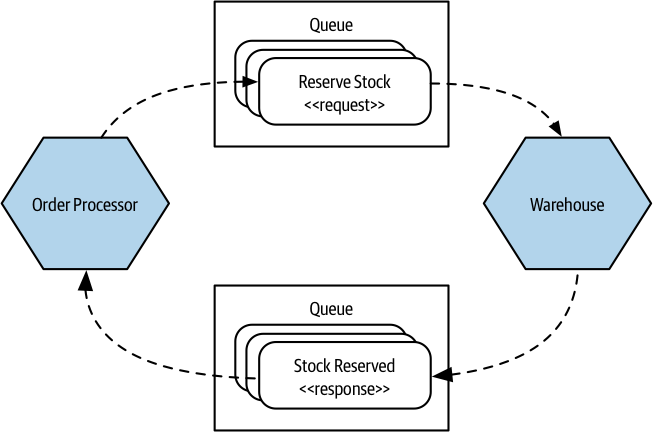

# Asynchronous Nonblocking Communication Style

Three of the most common forms of asynchronous communication:

- communication through common data
- request-response calls
- event-driven communication

## Communication Through Common Data

This pattern is used when one microservice puts data into a defined location, and another microservice then makes use of the data.

### Implementation

To implement this pattern, you need some sort of persistent store for the data. A filesystem in many cases can be enough, or you could use some sort of robust distributed memory store.

Downstream microservice that is going to act on this data will need its own mechanism to identify that new data is available, polling is a frequent solution to this problem.

> A **data lake** and a **data warehouse** are two common solutions for processing large volumes of data. They differ in their approach to data processing and coupling.
> 
> A **data lake** is a storage system where sources upload raw data in any format they see fit, and downstream consumers of this raw data are expected to know how to process the information. 
> 
> On the other hand, a **data warehouse** is a structured data store where microservices pushing data to the warehouse need to know the structure of the warehouse. If the structure changes in a backward-incompatible way, then these producers will need to be updated. 
>
> Both the data warehouse and the data lake assume that the flow of information is in a single direction. One microservice publishes data to the common data store, and downstream consumers read that data and carry out appropriate actions. This unidirectional flow can make it easier to reason about the flow of information.

### Advantages

The pattern is simple and can be implemented using commonly understood technology.

Data volumes are less of a concern if you're sending lots of data in one big go, this pattern can work well.

### Disadvantages

- This mechanism is not useful in low-latency situations.
- Downstream consuming microservices are aware of new data to process via polling or timed jobs.
- The common data store becomes a potential source of coupling.
- The robustness of the communication will also come down to the robustness of the underlying data store.

> If you're interested in sending larger volumes of data and having them processed more in "real time," then using some sort of streaming technology like Kafka would be a better fit.

### Where to Use It

- This pattern is useful in enabling interoperability between processes that might have restrictions on what technology they can use.
  - Even old mainframe systems should be able to read data out of a file.
  - Older systems may have limitations on what technology they can support and may have high costs of change.
- This pattern is useful for sharing large volumes of data, such as sending a multigigabyte file to a filesystem or loading a few million rows into a database.

## Request-Response Communication

A microservice sends a request to a downstream service asking it to do something and expects to receive a response with the result of the request.

> COMMANDS vs REQUESTS
>
> Some people use the term “command” instead of “request” in asynchronous request-response communication.
>
> The term request” is prefered over “command” because a command implies a directive that must be obeyed, while a request implies something that can be rejected.
>
> A microservice should examine each request, if it violates internal logic, the microservice should reject it.

### Implementation: Synchronous (blocking)

With a synchronous call, a network connection is opened with the downstream microservice, with the request being sent along this connection.

The connection is kept open while the upstream microservice waits for the downstream microservice to respond.

The microservice sending the response doesn't really need to know anything about the microservice that sent the request.

### Implementation: Asynchronous (nonblocking)

With an asynchronous request-response, the request is sent as a **message over a message broker**, rather than going directly to the downstream microservice.

The **downstream microservice** consumes messages from this queue when it is able. It reads the request, carries out the associated work.

The microservice that receives the request needs either to know implicitly where to **route the response** or else to be told where the response should go, typically, send the response back to a queue that the original microservice is reading from.

When **using a queue**, multiple requests could be buffered up in the queue waiting to be handled. This can help in situations in which the requests can't be handled quickly enough. The microservice can consume the next request when it is ready, rather than being overwhelmed by too many calls.

When a microservice receives a response in this way, it might need to **relate the response to the original request**. An easy way to handle this would be to store any state associated with the original request into a database, such that when the response comes in, the receiving instance can reload any associated state and act accordingly.

All forms of request-response interaction are likely going to require some form of **time-out handling** to avoid issues where the system gets blocked waiting for something that may never happen.

> PARALLEL vs ERSUS SEQUENTIAL CALLS
>
> When working with request-response interactions, you may need to make multiple calls before you can continue with some processing. Making these calls in sequence would result in waiting for the sum of latencies of each call.
>
> Running these requests in parallel would be a better option, and the overall latency of the operation would be based on the slowest API call.
>
> Reactive extensions and mechanisms like async/await can be very useful in helping to run calls in parallel, and this can result in significant improvements in the latency of some operations.

### Where to Use It

Request-response calls are suitable when the result of a request is needed before further processing can take place.

They are also useful when a microservice wants to know if a call didn't work so that it can carry out some sort of compensating action, like a retry.

## Event-driven

Microservices emit events, which other microservices consume and react to accordingly.

An event is a statement about something that has occurred, nearly always something that has happened inside the world of the microservice that is emitting the event.

The microservice emitting the event is unaware of which microservices consume the events it emits. The event emitter is leaving it up to the recipients to decide what to do. As a result, coupling is greatly reduced

With request-response, the microservice sending the request knows what should be done and is telling the other microservice what it thinks needs to happen next. The requester has to have knowledge of what the downstream recipient can do, implying a greater degree of domain coupling.

### Implementation

There are two main aspects to consider: a way for microservices to emit events and a way for consumers to find out those events have happened.

Message brokers like RabbitMQ handle both problems. Producers use an API to publish an event to the broker. The broker handles subscriptions, allowing consumers to be informed when an event arrives.

These brokers can even handle the state of consumers, for example, by helping keep track of what messages they have seen before.

These systems are normally designed to be scalable and resilient, but that can add complexity to the development process, because it is another system you may need to run to develop and test your services.

Additional machines and expertise may also be required to keep this infrastructure up and running.

### Event payload

As the microservice emitting an event, what should be inside the event so consumers can have what they need?

**Just an ID**

One option is for the event to just contain an identifier for the related entity (`ID`). Then consumers use that identifier to fetch the full information from the emitter microservice. There are some downsides with this approach:
- Consumers now have to know about the emitter microservice, adding additional domain coupling.
- In a situation with a large number of receiving microservices, the microservice emitting the event might get a barrage of fetch requests from consumers.

**Fully detailed events**

The prefered options is to put everything into an event that you would be happy otherwise sharing via a request-response API.

Events with more information can allow for looser coupling. It could help you as part of implementing an auditing system, or perhaps even provide the ability to reconstitute an entity at given points in time.

If the data associated with an event is large, we might have concerns about the size of the event.

> Kafka, a message brokers, has the default maximum size for a message in is 1 MB, gives us a lot of scope to send quite a bit of data.

### Where to Use It

Event-driven collaboration is effective in situations where information needs to be broadcast and downstream microservices can work independently.

In a situation where loose coupling is prioritized, event-driven collaboration is an attractive option.

Event-driven collaboration can introduce new sources of complexity, especially if you have limited exposure to it.

Microservice architecture can contain a mix of different styles of interaction, so it's not necessary to go all in with event-driven collaboration. Starting with just one event can be a good way to begin.

Far more teams replacing request-response interactions with event-driven interactions.

### Disadvantages

Event-driven architectures communication styles lead to an increase in complexity:

- manage publishing and subscribing to messages
- problems face for long-running async request-response
- monitoring, request tracing with correlation IDs, debugging, replicating errors
- it's a different way of thinking for programmers who are accustomed to intra-process synchronous message calls.

## EVENTS and MESSAGES

- An event is a statement that something happened, along with some information about exactly what happened.
- A message is a thing we send over an asynchronous communication mechanism, like a message broker.
- With event-driven collaboration, we want to broadcast that event, and a typical way to implement that broadcast mechanism would be to put the event into a message. The message is the medium; the event is the payload.
- We might want to send a request as the payload of a message. In which case we would be implementing a form of asynchronous request-response.
