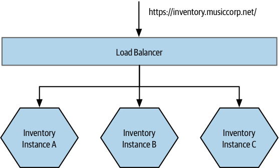

# Service Discovery

As the number of microservices in an environment grows, the need for service discovery becomes essential. It involves knowing where services are running, monitoring them, assisting consumers in finding services, and facilitating developers in reusing existing APIs.

Service discovery typically involves two parts: **registration**, where a service instance announces its presence, and **lookup**, where consumers find the service.

## Domain Name System (DNS)

DNS (Domain Name System) allows associating a name with the IP address of one or more machines. This can be used to provide a human-readable name for a microservice.

A microservice can be associated with a DNS name like "accounts.musiccorp.net," and this name can resolve to the IP address of a host running the microservice or a load balancer distributing traffic across multiple instances.

Managing DNS entries is necessary when deploying and updating services.

when dealing with instances of a service in different environments, convention-based domain templates work well.

> For example, we might have a template defined as `<servicename>-<environment>.musiccorp.net`, giving us entries like `accounts-uat.musiccorp.net` or `accounts-dev.musiccorp.net`.

While DNS is a well-understood and widely supported standard, managing DNS in environments with disposable hosts can be challenging. Updating DNS entries for such hosts can be complex.

### Time To Live problem

DNS entries for domain names have a Time to Live (TTL), indicating how long a client can consider the DNS entry fresh.

When updating DNS entries to change the host associated with a domain name, it's essential to consider that clients may retain the old IP address for at least as long as the TTL specifies.

DNS entries can be cached in various places, including the JVM, which may cache DNS entries unless explicitly configured not to do so.

To work around the problem of clients holding onto stale DNS entries, one approach is to configure the domain name entry for a service to point to a load balancer.

The load balancer, in turn, points to the instances of the service. When deploying a new instance, you can remove the old one from the load balancer configuration and add the new one.

This strategy can help manage DNS entries in a way that minimizes service disruptions during updates and ensures that clients gradually shift to the new instances without relying on cached DNS entries.

> Some people use DNS round-robining, where the DNS entries themselves refer to a group of machines. This technique is extremely problematic, as the client is hidden from the underlying host and therefore cannot easily stop routing traffic to one of the hosts should it become sick.

## Dynamic Service Registries

The downsides of DNS as a way of finding nodes in a highly dynamic environment have led to a number of alternative systems.

Many of these alternative systems involve services registering themselves with a central registry, which then provides the capability to look up these services at a later time.

### ZooKeeper

ZooKeeper was originally developed as part of the Hadoop project and serves various purposes, including configuration management, data synchronization between services, leader election, message queues, and naming services.

ZooKeeper relies on running a cluster of nodes, typically at least three, to provide guarantees, ensuring data replication and consistency in the presence of node failures.

ZooKeeper provides a hierarchical namespace for storing information. Clients can insert, modify, or query nodes in this hierarchy and set watches to be notified when nodes change.

It is often used as a general configuration store and can be employed to store service-specific configurations, enabling dynamic changes to settings like log levels or feature toggles.

In reality, better solutions exist for dynamic service registration, so ZooKeeper is avoided for this use case nowadays.

### Consul

Consul, like ZooKeeper, supports configuration management and service discovery but goes further in providing robust support for these use cases.

> It offers an HTTP interface for service discovery and provides an out-of-the-box DNS server, including support for SRV records, enabling easy integration into existing systems.

Consul allows performing health checks on nodes, potentially overlapping with monitoring tools. You would more likely use Consul as a source of this information and then pull it into a more comprehensive monitoring setup.

Consul uses a RESTful HTTP interface for various operations, making integration with different technology stacks straightforward.

Consul includes a suite of tools to enhance its functionality, such as **consul-template**. This tool allows text files to be dynamically updated based on entries in Consul.

**Consul-template** facilitates dynamic updates to configuration files across the system, even for programs that read their configuration from text files. This feature can be utilized for dynamically adding or removing nodes from load balancer pools using software load balancers like HAProxy.

Consul's features and tools make it a powerful choice for service discovery and configuration management in microservices environments, improving ease of integration and dynamic updates across systems.

### etcd and Kubernetes

Kubernetes provides built-in service discovery mechanisms as part of its container orchestration platform.

Kubernetes leverages etcd, a configuration management store that is bundled with Kubernetes, for service discovery.

Kubernetes uses pods to deploy containers, and services dynamically identify which pods should be part of a service by pattern matching on metadata associated with the pod.

This service discovery mechanism in Kubernetes is efficient and powerful, as it allows requests to be routed to one of the pods that constitute the service.

The capabilities provided by Kubernetes may be sufficient for many use cases, and users may not need dedicated service discovery tools like Consul, especially if the broader Consul ecosystem isn't required.

However, in mixed environments where workloads run both on Kubernetes and elsewhere, having a dedicated service discovery tool that can be used across both platforms may be a beneficial approach.

## Don’t Forget the Humans!

Humans may also require access to service discovery information.

Making the information available in ways that allow for humans to consume it, perhaps by using APIs to pull this detail into humane registries can be vital.
