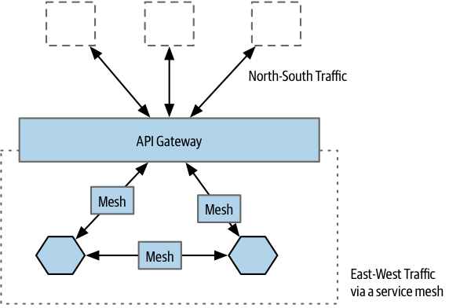

# Service Meshes and API Gateways

**Service meshes** and **API gateways** are two technologies that have received significant attention and generated some confusion within the realm of microservices.

Both service meshes and API gateways have their roles and use cases, but there can be some overlap in their responsibilities.

It's important to understand how these technologies fit into a microservices architecture and to avoid potential misuse or misinterpretation.

## Networked Perimeter

The term "networked perimeter" could relate to an entire data center, a Kubernetes cluster, or perhaps just a virtual networking concept like a group of machines running on the same virtual LAN.

In a networked perimeter, an **API gateway** typically handles **"north-south"** traffic. Its primary role is to manage access from the outside world to the internal microservices.

A **service mesh**, on the other hand, primarily addresses **"east-west"** traffic, focusing on the communication between microservices within the networked perimeter.

## Reverse proxy

A reverse proxy is a server that sits in front of one or more web servers, intercepting requests from clients. 

This is different from a forward proxy, where the proxy sits in front of the clients.

Reverse proxies are typically implemented to help increase security, performance, and reliability. They can be used to protect web servers from attacks, distribute traffic across multiple servers, and cache content to improve performance.

In contrast to a forward proxy, which is used to protect clients’ privacy and anonymity, a reverse proxy is used to protect the server’s identity and hide its internal structure. When a client sends a request to a web server through a reverse proxy, the request appears to come from the reverse proxy rather than the client itself. This makes it more difficult for attackers to identify and exploit vulnerabilities in the web server.

Reverse proxies can also be used to provide additional services such as load balancing, SSL encryption, and content filtering. They are commonly used in large-scale web applications and content delivery networks (CDNs).

## API Gateways

The primary function of an API gateway is to map external requests to the appropriate internal microservices, often acting as a reverse proxy. It extends the capabilities of HTTP proxy products and is designed for handling external access.

API gateways can implement various features, including security mechanisms like API keys, request logging, rate limiting, and more.

API gateways are commonly used for managing access to microservices from an organization's GUI clients (such as web pages and native mobile applications) via the public internet, they can be overkill in scenarios where there is no involvement of external third parties.

> For Kubernetes environments, an API gateway is essential because Kubernetes manages networking only within the cluster and doesn't address external communication.

### Where to use them

When your primary concern is exposing microservices running in Kubernetes, it's possible to handle this by running your own reverse proxies or considering dedicated products like Ambassador, designed specifically for Kubernetes environments.

For scenarios involving a large number of third-party users accessing your API, there are specialized products available that may be more suitable for managing external access and providing additional features.

### What to avoid

Misuse of API gateways can occur when they are used for **call aggregation** and **protocol rewriting**. These practices can lead to the unintentional addition of complex business logic into the API gateway layer, which is not its intended purpose.

**Call aggregation and filtering** are better handled through dedicated tools or patterns like GraphQL or the Backend-for-Frontend (BFF) pattern. Complex business processes should be explicitly modeled and managed, rather than pushed into an API gateway.

**Protocol rewriting**, such as changing SOAP APIs into REST APIs, is often considered a task for API gateways. However, REST is a broader architectural concept that cannot be fully implemented in an intermediary layer. This practice can lead to placing too much behavior in the wrong place.

Violating the principle of "keeping the pipes dumb and the endpoints smart" can be problematic. In microservices, the goal is to have independent deployability and manage changes within the microservices themselves. Placing too much behavior in API gateways leads to restricted control and more complicated change management.

Using API gateways as intermediaries for all inter-microservice calls can introduce additional network hops and increase latency. Service meshes are much better placed to solve this problem.

## Service Meshes

Service meshes reduce the functionality that individual microservices need to implement internally. They provide common features for inter-microservice communication, such as mutual TLS, correlation IDs, service discovery, and load balancing.

Common functionality in service meshes is often generic and can be shared across microservices. This is typically achieved by using shared libraries, but challenges may arise when different microservices have different versions of these libraries or are written in different runtimes.

Service meshes allow for the reuse of common inter-microservice functionality across microservices written in different programming languages.

Service meshes help implement standard behavior across microservices created by different teams, fostering consistency and best practices.

Service meshes make it easier to implement and change common behavior across microservices. Instead of requiring every microservice to update and redeploy shared libraries, changes can be rolled out more flexibly in terms of inter-microservice communication.

### How they work

In a microservice architecture, there is typically less north-south traffic (traffic between clients and services) compared to east-west traffic (traffic between services).

Service meshes come in various forms, but they share a common goal: limiting the impact of calls to and from the proxy.

One key strategy for achieving this goal is to distribute the proxy processes on the same physical machines as the microservice instances. This approach minimizes the number of remote network calls and helps optimize performance.

> The Order Processor is sending a request to the Payment microservice. This call is first routed locally to a proxy instance running on the same machine as Order Processor, before continuing to the Payment microservice via its local proxy instance.
>
> The Order Processor thinks it’s making a normal network call, unaware that the call is routed locally on the machine, which is significantly faster (and also less prone to partitions).

A control plane in a service mesh architecture is positioned above the local mesh proxies. It serves as a central point for altering the behavior of these proxies and gathering information about their activities.

When deploying microservices on Kubernetes, each microservice instance is placed in a pod, and each pod has its own local proxy. Pods are deployed as single units, ensuring that there is always a proxy available. If a proxy within a pod fails, it only affects that specific pod, and this setup allows for different proxy configurations for different purposes.

Many service mesh implementations rely on the Envoy proxy as the foundation for these locally running processes. Envoy is a lightweight C++ proxy commonly used in building service meshes and other proxy-based software, serving as a crucial component in projects like Istio and Ambassador.

The proxies in the service mesh architecture are managed by a control plane. The control plane is a set of software tools designed to monitor and control the activities of the proxies. 

> For instance, in implementing mutual TLS (Transport Layer Security), the control plane is responsible for distributing client and server certificates, enhancing security within the service mesh.

### Aren’t service meshes smart pipes?

There may be concerns or reservations about the idea of moving common behavior into a service mesh.

There's a question of whether this approach might suffer from the same issues as enterprise service buses or overly complex API gateways, which can sometimes become overly bloated or introduce problems.

The key distinction to make is that the common behavior being integrated into the service mesh is not specific to any one microservice. It doesn't expose or leak business functionality to the outside world. Instead, it deals with configuring generic behaviors, such as how request time-outs are handled.

In terms of common behavior that might want to be tweaked on a per-microservice basis, that’s typically something that is well catered for, without the need for work to be done on a central platform.

### Do you need one?

Service meshes aren’t for everyone. Firstly, if you aren’t on Kubernetes, your options are limited. Secondly, they do add complexity. 

Implementing a service mesh might not be justifiable for organizations with a small number of microservices. In the case of only having a few microservices (e.g., five), the overhead and complexity of a service mesh may not be necessary or cost-effective.

For organizations that have more microservices, especially if they want the option for those microservices to be written in different programming languages, service meshes are well worth a look.

## What About Other Protocols?

API gateways and service meshes are primarily used to handle HTTP-related calls. They are effective for managing protocols like REST, SOAP, gRPC, and similar HTTP-based communication methods.

However, when dealing with communication via other protocols, such as message brokers like Kafka, the role of the service mesh becomes less clear. In these cases, it is common for communication to bypass the service mesh, and services communicate directly with the message broker.

This means that you cannot assume your service mesh is able to work as an intermediary for all calls between microservices.