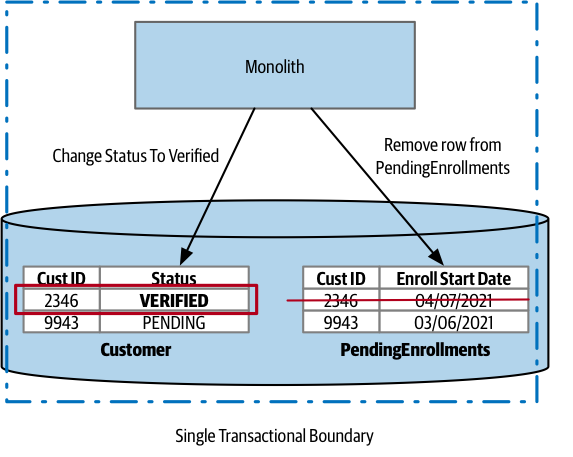

# Database Transactions

In the context of computing, a transaction refers to one or more actions that are treated as a single unit. These actions are expected to occur together, and their success or failure is confirmed as a whole.

Transactions are commonly used when multiple changes need to be made as part of a single operation. They ensure that all changes are either applied successfully or rolled back in case of an error.

With a database, we use a transaction to ensure that one or more state changes have been made successfully. This could include data being removed, inserted, or changed. 

In a relational database, this could involve multiple tables being updated within a single transaction.

## ACID Transactions

Typically when we talk about database transactions, we are talking about ACID transactions.

ACID is an acronym that represents the key properties of database transactions, ensuring reliability and data consistency in data storage.

ACID stands for: atomicity, consistency, isolation, and durability

### Atomicity

Ensures that the operations attempted within the transaction either all complete or all fail. If any of the changes we’re trying to make fail for some reason, then the whole operation is aborted, and it’s as though no changes were ever made.

### Consistency

When changes are made to our database, we ensure it is left in a valid, consistent state.

### Isolation

Allows multiple transactions to operate at the same time without interfering.

### Durability

Makes sure that once a transaction has been completed, we are confident the data won’t get lost in the event of some system failure.

All relational database systems provide ACID transactions.

MongoDB for many years supported ACID transactions only on changes being made to a single document, which could cause issues if you wanted to make an atomic update to more than one document.

## Still ACID, but Lacking Atomicity?

A microservice is free to use an ACID transaction for operations to its own database, the scope of these transactions is reduced to state change that happens locally within that single microservice.

> Look at an example, we are keeping track of the process involved in onboarding a new customer. We’ve reached the end of the process, which involves changing the Status of customer *2346* from `PENDING` to `VERIFIED`.
>
> As the enrollment is now complete, we also want to remove the matching row from the `PendingEnrollments` table. With a single database, this is done in the scope of a single ACID database transaction—either both of these state changes occur, or neither occurs.

> Compare it with when we’re making exactly the same change, but each change is made in a different database. This means there are two transactions to consider, each of which could work or fail independently of the other.

> We remove a row from the `PendingEnrollments` table only if we could change the row in the `Customer` table. But we’d still have to reason about what to do if the deletion from the `PendingEnrollments` table then failed. All logic that we’d need to implement ourselves.
>
> We have to accept that by decomposing this operation into two separate database transactions, we’ve lost guaranteed atomicity of the operation as a whole.

The lack of atomicity can start to cause significant problems, especially if we are migrating systems that previously relied on this property.

Becase the process now spans multiple processes, people start considering a distributed transaction. Unfortunately, distributed transactions may not be the right way forward.
