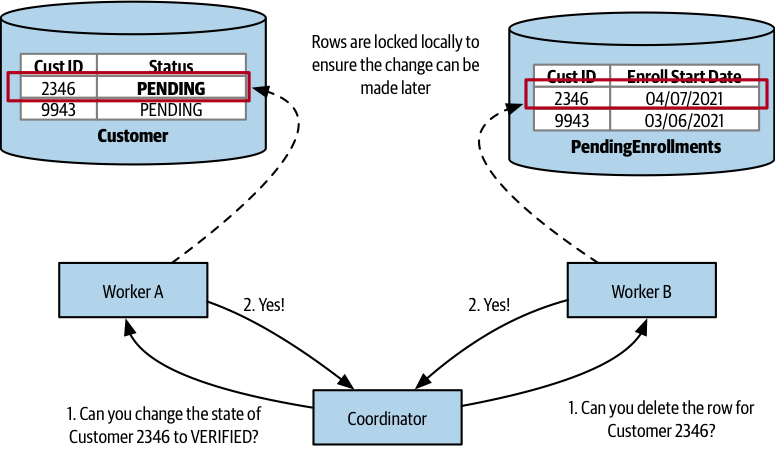
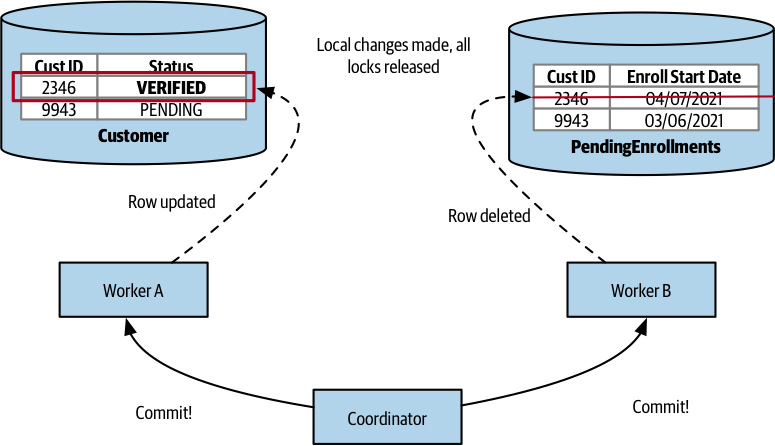

# Distributed Transactions - Two-Phase Commits

## How it works

The Two-Phase Commit (2PC) algorithm is commonly used to enable transactional changes in distributed systems, especially in microservice architectures where multiple separate processes need to be updated as part of a single operation.

2PC consists of two phases: the voting phase and the commit phase.

During the **voting phase**, a central coordinator contacts all the workers involved in the transaction to confirm whether a state change can be made.

If all workers agree to the state change during the voting phase, the algorithm proceeds to the commit phase. However, if any worker disagrees, the entire operation is aborted.

It's important to note that a worker's agreement during the voting phase doesn't immediately effect the change but guarantees that the change will be made in the future. Workers may need to lock records to ensure they can make the change.

If any workers did not vote in favor of the commit, a rollback message is sent to all parties involved. This allows workers to clean up locally and release any locks they may be holding.

If all workers agreed to make the change, the **commit phase** is executed, and the changes are made. Associated locks are released, and the transaction is successfully completed.

## Inconsistent state

In a system using the Two-Phase Commit (2PC) algorithm, there is no guarantee that commits will occur simultaneously. The coordinator sends the commit request to all participants, and variations in message delivery and processing times can lead to inconsistencies in the timing of changes made by different participants. This can violate the isolation property in the ACID model, as it may allow for the observation of intermediate states during a transaction.

## Managing locks

Two-Phase Commit often involves coordinating distributed locks, which can be challenging. In a single-process system, managing locks and avoiding deadlocks is complex, and these challenges increase when dealing with multiple participants.

## Failure

Two-Phase Commit can lead to various failure modes, including scenarios where a worker agrees to proceed with a transaction but fails to respond when asked to commit. Some failures can be handled automatically, but others may require manual intervention by an operator to resolve.

## Latency

The effectiveness of Two-Phase Commit is influenced by the number of participants and the level of latency in the system. As more participants are involved and latency increases, Two-Phase Commit may become less efficient and inject significant delays into the system.

## When to use it

It is typically used for short-lived operations to avoid resource locking for extended periods.

## Avoid Distributed Transactions

It is strongly recommended to **avoid the use of distributed transactions** for coordinating changes in a microservices architecture due to the complexities and challenges associated with them.

An alternative approach is to consider **not splitting data** across microservices in the first place. If there are pieces of state that require atomicity and consistency, and it's challenging to achieve these characteristics without an ACID-style transaction, leaving that state in a single database and managing it within a single service or monolith may be a viable solution.

When deciding how to split a monolithic application into microservices, it's important to assess whether it's feasible to separate data that was previously managed within a transaction. If it's too difficult to handle at the moment, it may be advisable to **focus on other aspects of the system first** and revisit this issue later.