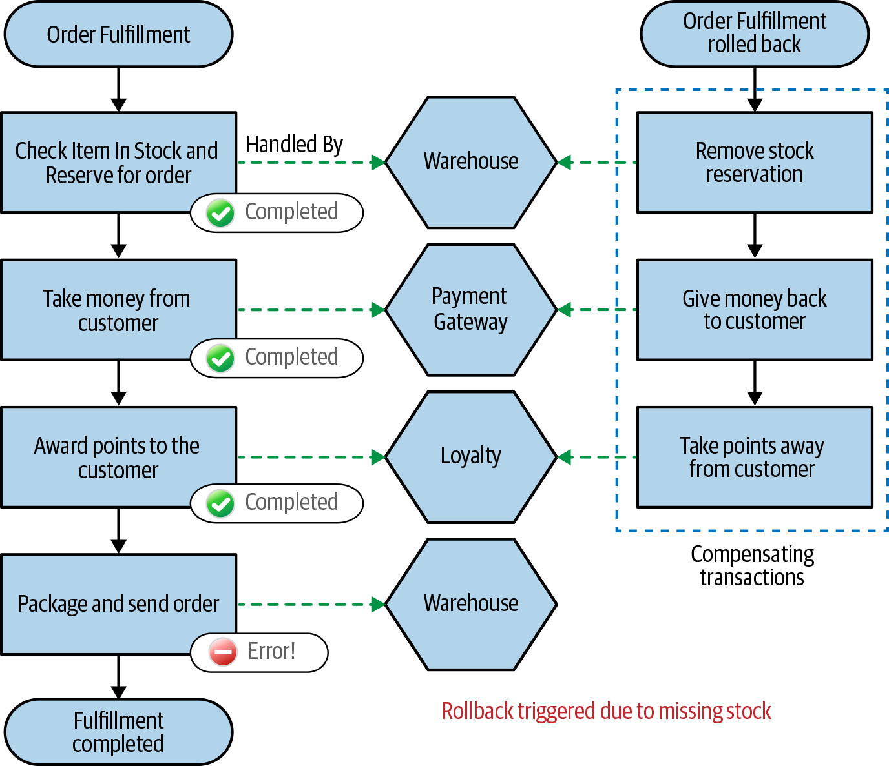
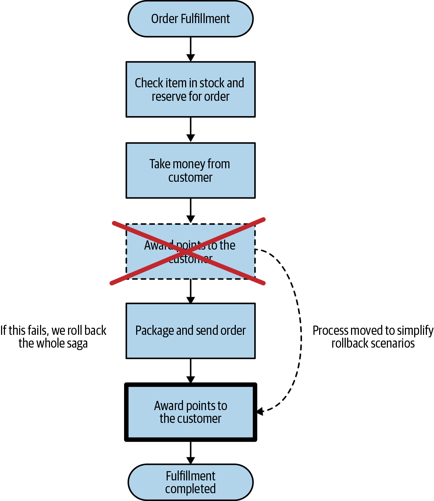
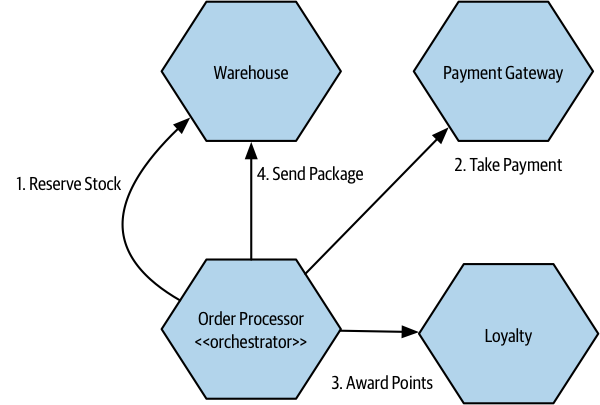
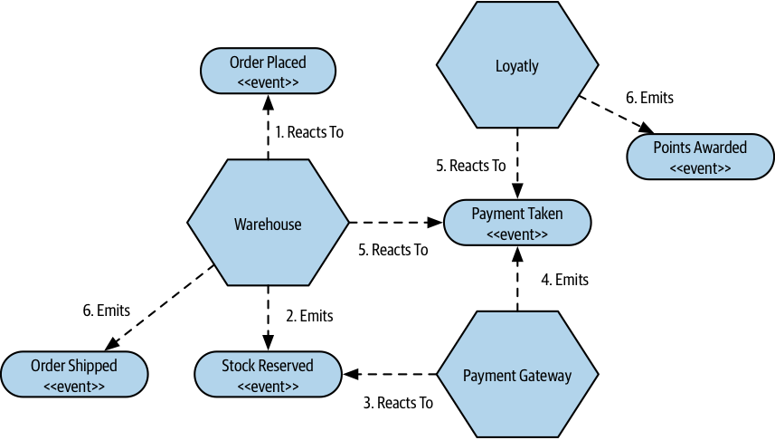

# Sagas

## Overview

The SAGA pattern is a design pattern used in distributed systems for managing long-lived transactions (LLTs) that need to span multiple microservices or components.

Unlike traditional distributed transactions like the two-phase commit, sagas are designed to coordinate multiple state changes without the need for locking resources for extended periods.

In this pattern, a transaction is divided into a sequence of smaller local transactions, called saga steps. Each saga step represents an operation or a task that needs to be performed within a specific microservice.

The key idea behind the SAGA pattern is that each individual saga step is responsible for managing its own local transaction, which means it can either commit or rollback independently.

If a saga step succeeds, it triggers the next step; otherwise, it compensates for the changes made by the previous steps by performing a compensating action.

The SAGA pattern helps in achieving eventual consistency in distributed systems, where different operations are executed in parallel across multiple services. It ensures that even if some of the steps fail, the system can recover and reach a consistent state by rolling back the changes made by the previous steps.

## No atomicity

Saga does not give us atomicity in ACID terms such as we are used to with a normal database transaction

As we break the LLT into individual transactions, we don’t have atomicity at the level of the saga itself. 

We do have atomicity for each individual transaction inside the overall saga, as each one of them can relate to an ACID transactional change if needed. 

What a saga gives us is enough information to reason about which state it’s in; it’s up to us to handle the implications of this.

## Recover from failures

With a saga being broken into individual transactions, we need to consider how to handle failure (recover when a failure happens).

The original saga paper describes two types of recovery: **backward recovery** and **forward recovery**.

**Backward recovery** involves rolling back and cleaning up after a failure. For this to work, we need to define compensating actions that allow us to undo previously committed transactions.

**Forward recovery** allows the system to continue processing from the point of failure. For that to work, we need to be able to retry transactions and persist enough information to allow this retry to take place.

Depending on the nature of the business process being modeled, you may expect that any failure mode triggers a backward recovery, a forward recovery, or perhaps a mix of the two.

### Business failures

It’s really important to note that a saga allows us to recover from business failures, not technical failures. 

> For example, if we try and take payment from the customer but the customer has insufficient funds, then this is a business failure that the saga should be expected to handle. 
> 
> On the other hand, if the Payment Gateway times out or throws a 500 Internal Service Error, then this is a technical failure that we need to handle separately.

The saga assumes the underlying components are working properly—that the underlying system is reliable, and that we are then coordinating the work of reliable components.

## Saga rollbacks

If you want to implement a rollback, you need to implement a compensating transaction.

A compensating transaction is an operation that undoes a previously committed transaction.

We would trigger the compensating transaction for each step in our saga that has already been committed.

In this situation, we are creating a new transaction that reverts the changes made by the original transaction, but we can’t roll back time and make it as though the original transaction didn’t occur.

Because we cannot always cleanly revert a transaction, we say that these compensating transactions are semantic rollbacks.

> As an example, one of our steps may have involved sending an email to a customer to tell them their order was on the way. If we decide to roll that back, we can’t unsend an email!
>
> Instead, our compensating transaction could cause a second email to be sent to the customer, informing them that there was a problem with the order and it has canceled.

It's important for information related to the rollback to persist in the system. You may want to keep a record in the Order service for this aborted order, along with information about what happened, for a whole host of reasons.

## Minimizing rollbacks by reordering workflow steps

Sometimes you can simplify your rollback operations (reduce rollback steps) just by tweaking how your workflow is carried out.

By pulling forward those steps that are most likely to fail and failing the process earlier, you avoid having to trigger later compensating transactions. This can be especially important if implementing a compensating transaction is difficult.

> We could made our rollback scenarios simpler by reordering the steps in our original workflow. A simple change would be to award points only when the order is actually dispatched.
> 
> In this way we would avoid having to worry about that stage being rolled back if we were to have a problem while trying to package and send the order.

## Fail-forward situations

Some failures may require a rollback (fail backward); others may be fail forward.

> For the order processing, if for whatever reason we can’t dispatch the package, it seems very odd to roll the whole order back.
>
> Instead, we’d probably just retry the dispatch, and if that fails, we’d require human intervention to resolve the situation.

## Implementing Sagas

Two styles of saga implementation: **Orchestrated sagas** and **Choreographed sagas**.

### Orchestrated sagas

Orchestrated sagas use a central coordinator (orchestrator) to define the order of execution and to trigger any required compensating action.

The orchestrator knows what services are needed to carry out the operation, and it decides when to make calls to those services. If the calls fail, it can decide what to do as a result.

Orchestrated sagas tend to make heavy use of request-response interactions between services.

> The `Order Processor` sends a request to services (such as a Payment Gateway) and expects a response to let it know if the request was successful and provide the results of the request.

**Advantages**:

Having business process explicitly modeled inside the orchestrator allows us to look at one place in our system and understand how this process is supposed to work.

**Downsides**:

- The orchestrator needs to know about all the associated services, resulting in a higher degree of domain coupling.
- Logic that should otherwise be pushed into the services can start to become absorbed in the orchestrator instead. That makes services become anemic. It’s important that the services that make up these orchestrated flows as entities that have their own local state and behavior.

### Choreographed sagas

A choreographed saga aims to distribute responsibility for the operation of the saga among multiple collaborating services.

Choreographed sagas will often make heavy use of events for collaboration between services.

Events are broadcast in the system, and microservices are able to receive and react to them.  It’s possible that multiple microservices may react to the same event.

> In the example, when the `Warehouse` service receives that first `Order Placed` event, it knows its job is to reserve the appropriate stock and fire an event once that is done.
>
> If the stock couldn’t be received, the `Warehouse` would need to raise an appropriate event, which might lead to the order being aborted.
> 
> When the `Payment Taken` event is fired by the `Payment Gateway`, it causes reactions in both the `Loyalty` and `Warehouse` microservices. The `Warehouse` reacts by dispatching the package, while the `Loyalty` microservice reacts by awarding points.

**Advantages**:

No service knows about any other microservice. They need to know only what to do when a certain event is received. The amount of domain coupling is drastically reduced. This makes a much less coupled architecture.

As the implementation of the process is decomposed and distributed among microservices, we also avoid the concerns about centralization of logic.

**Downsides**:

It can be harder to work out what the business process is supposed to be. You’d have to look at the behavior of each service in isolation and reconstitute this picture in your own head.

It lacks a way of knowing what state a saga is in, which can deny us the chance to attach compensating actions when required.

To address this issue, one approach is to create a unique ID for the saga, known as a correlation ID. The correlation ID is included in all events emitted as part of the saga.

When a service reacts to an event, it extracts and uses the correlation ID for local logging processes. The correlation ID is also passed downstream with subsequent calls or events.

A dedicated service can gather and process these events, providing a view of the state for each order. This service can programmatically take actions to resolve issues as part of the fulfillment process, especially if other services cannot handle them on their own.

## Choreographed or orchestration?

Implementing choreographed sagas can introduce unfamiliar concepts and event-driven collaboration, which may require a shift in thinking for the team.

However, despite the complexity of tracking saga progress, the benefits of a more loosely coupled architecture often outweigh the challenges.

Orchestration is more suitable when a single team owns the entire saga, leading to a more inherently coupled architecture that is easier to manage within the team boundary.

For scenarios involving multiple teams, **choreographed sagas are preferred** because they allow for more distributed responsibility and work in isolation due to their loosely coupled architecture.

Orchestration tends to involve request-response-based calls, while choreography makes more extensive use of events.

## Sagas Versus Distributed Transactions

Distributed transactions come with some significant challenges and should be avoided

Modeling business processes as sagas avoids distributed transaction challenges and enhances clarity for developers. Making the core business processes of your system a first-class concept will have a host of advantages.