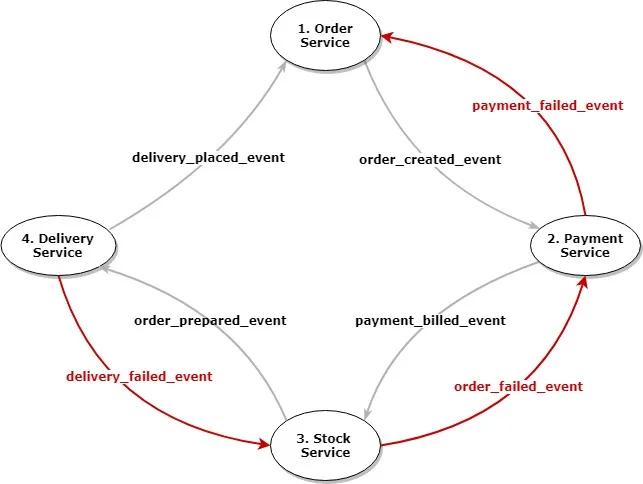
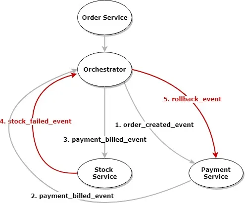

# SAGA Pattern Briefly

# What is the SAGA Pattern?

The SAGA pattern is a design pattern used in distributed systems for managing long-lived transactions that need to span multiple microservices or components.

In this pattern, a transaction is divided into a sequence of smaller local transactions, called saga steps. Each saga step represents an operation or a task that needs to be performed within a specific microservice.

The key idea behind the SAGA pattern is that each individual saga step is responsible for managing its own local transaction, which means it can either commit or rollback independently.

If a saga step succeeds, it triggers the next step; otherwise, it compensates for the changes made by the previous steps by performing a compensating action.

The SAGA pattern helps in achieving eventual consistency in distributed systems, where different operations are executed in parallel across multiple services. It ensures that even if some of the steps fail, the system can recover and reach a consistent state by rolling back the changes made by the previous steps.

## When to use it?

When atomicity is not a necessity in distributed systems, like microservices-based architectures

## Communication between microservices

Communication between services should be asynchronous to allow for compensation actions and handling failures gracefully.

## Choreography-Based Saga

Each service performs its process, and if the result is successful, it fires a success event for the next step to continue.

In case of a failure, it fires a failure event for the previous step. So, the services that have worked before this step can sequentially perform rollbacks.

This approach is useful for cases that consist of only a few steps. It becomes more complicated when including more steps.

- Order Service creates the order and sends `order_created_event` into the message queue.
- Payment Service first receives the message, creates the payment and then sends `payment_billed_event` into the message queue.
- Stock Service receives this message from Payment Service, performs the required processes, and sends `stock_prepared_event` to the message queue.
- Delivery Service runs into an error when performing this event and sends back a `delivery_failed_event` message to roll back the entire process.
- Stock Service receives this failure message using the transaction_is provided in it, performs a compensation process, and sends back `stock_failed_event`.
- Finally, Payment Service receives the failure message and performs its compensation process, and sends `payment_failed_event` for Order Service.
- Order Service for such cases can use a retry mechanism with some delay, and if the error persists, it can use some warning mechanisms for a manual check.

## Orchestration-Based Saga

There would be an orchestrator to manage the entire operation from one center.

An orchestrator receives a start command from a source and commences calling related services sequentially.

After each successful response, it makes the next call to the following service.

If one of the steps fails and the service returns a failure message, the orchestrator makes rollback calls for each previous step/service.

Orchestration-Based Saga brings along some scalability issues and the risk of a single point of failure, developers should consider necessary recovery actions.

- Order Service creates the order and employs the Orchestrator.
- Orchestrator sends `order_created_event` for Payment Service.
- Payment Service creates the payment and sends `payment_billed_event` for the Orchestrator.
- This time, the Orchestrator sends `payment_billed_event` for Stock Service.
- Stock Service runs into an error when performing this event and sends `stock_failed_event` for Orchestrator.
- Orchestrator initiates the rollback cycle and sends `rollback_event` for the previous service being the Payment Service in this scenario.
- Payment Service performs a compensation process after receiving this message.