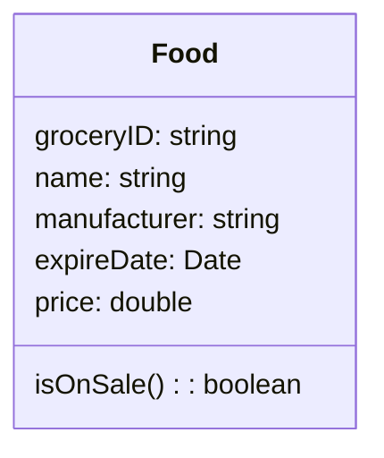
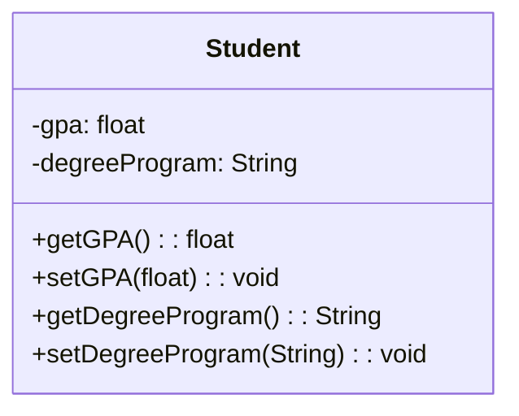
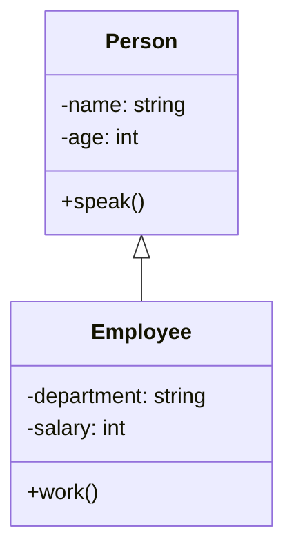
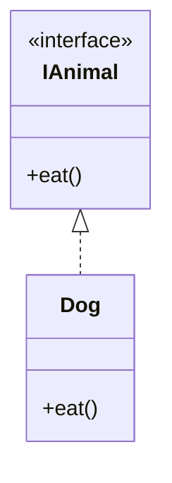

# Four Design Principles

Object-oriented programming is defined by a set of design principles that guide the creation of programs. These principles ensure that the resulting systems are well-organized and easy to maintain.

## Abstraction

Abstraction is one of the main ways that humans deal with complexity. It's the idea of simplifying a concept in the problem domain to its essentials within some context. 

Abstraction allows you to better understand a concept by breaking it down into a simplified description that ignores unimportant details.

When designing an object-oriented program, abstraction is essential. You create models of how objects are represented in your system, but these models cannot be created without forethought.

In object-oriented modeling, abstraction pertains most directly to the notion of a **class**. When you use abstraction to decide the essential characteristics for some concept, it makes the most sense to define all of those details in a class named after the concept. 

### Choosing Relevant Attributes and Behaviors

*Let's take the concept of a person. What are the essential characteristics of a person that we care about? This question is hard to answer because person is so vague and we haven't said what the purpose of our person is.*

The abstractions you create are relative to some context, and there can be different abstractions for one concept.

When considering abstraction, we must identify relevant attributes and behaviors for a concept.

*For example, in an academic setting, relevant attributes for a student would include the courses they're currently taking, their grades in each course, and their student ID number. Relevant behaviors would include studying, doing assignments, and attending lectures.*

Within the context of an abstraction, anything other than a concept's essential attributes and behaviors is irrelevant.

*When considering our student in the context of an academic setting, we don't care whether the student has a pet or how they clean their kitchen or what their favorite video game is. Those are all irrelevant details to the abstraction in this context.*

### Updating Abstraction

Abstractions are formed within a specific context for perspective, and you have to carefully decide what is relevant. 

If the purpose of your system or the problem changes, don't be afraid to update your abstractions accordingly.

Abstractions are not a fixed creation but are a direct result of the problem for which you created them.


## Encapsulation

### What is Encapsulation?

Encapsulation involves bundling attribute values or data and behaviors or functions that manipulate those values together into a self-contained object. It involves three key ideas as follows:
- Bundling of attribute values or data and behaviors or functions that manipulate those values together into a self-contained object. 
- Exposing certain data and functions of the object, which can be accessed from other objects.
- Restricting access to certain data and functions to only within that object.

### Why is Encapsulation Important?

Encapsulation forms a self-contained object by bundling the data and functions it requires to work, exposes an interface whereby other objects can access and use it, and restricts access to certain inside details. This makes programming easier when data, and the code that manipulates that data, are located in the same place. 

### Encapsulation and Classes

Encapsulation naturally occurs when you define a class for a type of object. Abstraction helps determine what attributes and behaviors are relevant about a concept in some context. Encapsulation ensures that these characteristics are bundled together in the same class.

### Methods and Behaviors

Besides attributes, a class also defines behaviors through methods. For an object of the class, the methods manipulate the attribute values or data in the object to achieve the actual behaviors. You can expose certain methods to be accessible to objects of other classes, thus, providing an interface to use the class.

### Data Integrity and Security

Encapsulation helps with data integrity by defining certain attributes and methods of a class to be restricted from outside access. In practice, you often present outside access to all the attributes except through specific methods. This way, the attribute values of an object cannot be changed directly through variable assignments.

### Achieving Abstraction Barrier

Encapsulation achieves what is called the Abstraction Barrier. Since the internal workings are not relevant to the outside world, this achieves an abstraction that effectively reduces complexity for the users of a class. This increases reusability because another class only needs to know the right method to call to get the desired behavior, what arguments to supply as inputs, and what appear as outputs or effects.


## Decomposition

### Understanding Decomposition

Decomposition involves breaking down a whole thing into different parts or combining separate parts with different functionalities to form a complete object. This helps in solving complex problems by making them easier to understand. 

*For instance, considering an object like a car or refrigerator, using decomposition, we can break it down into different parts that have specific responsibilities. A transmission, motor, wheels, tires, doors, windows, seats, and fuel are some of the constituent parts of a car, whereas a refrigerator may have parts like compressor and coils, freezer, ice-maker, shelves, drawers, and food items. Each of these parts has a specific purpose towards achieving the overall objective of the whole.*


### Fixed vs Dynamic Number of Parts

The lifetime of a whole object and its parts determines if the number of parts is fixed or dynamic. 

A fridge has a fixed number of freezers, but the number of shelves and food items can vary over time. In contrast, some parts like steering wheels, tires, and engines in cars have a fixed number, whereas the number of passengers is dynamic.

### Parts within Parts

A part of an object can act as a whole and contain further constituent parts.

For example, an instrument panel in a car contains speedometers, odometers, and fuel gauges, among other parts. 

### Related Lifetimes

Sometimes, the lifetimes of the whole and its parts are closely related.

The refrigerator and the freezer have the same lifetime, and one cannot exist without the other. However, this is not true for all parts, as some parts like food items in a fridge can exist independently. 

### Parts Sharing

Objects may contain parts that are shared among them at the same time.

For instance, multiple families can share a person as their common family member. However, sometimes sharing is not possible or intended, and each object has its unique parts. 

Overall, decomposition enables breaking down a complicated object into separate, simpler parts with specific roles. It's important to evaluate how different responsibilities of some whole object can be separated into different parts, each with its own specific responsibility, based on fixed or dynamic numbers, lifetimes, and sharing, where applicable.


## Generalization

Generalization is a design principle that helps to reduce redundancy when solving problems.

It allows us to model behaviors using methods and eliminates the need to have identical code written throughout a program.

### Applying Generalization through Inheritance

Generalization can be applied to classes through inheritance.

In this process, we take repeated or shared characteristics between two or more classes and factor them out into another class. Specifically, we create a parent class and a child class. When a child class inherits from a parent class, it receives the attributes and behaviors of the parent class. The parent class is known as a superclass, and the child class is called a subclass.

### Example: Generalizing Animal Characteristics

For example, if we want to model the characteristics and behaviors of a cat and a dog, we can create a superclass called "animal" that contains the common attributes and behaviors between them.

Both cat and dog subclasses inherit these attributes and behaviors from the animal superclass. This makes our code more flexible, maintainable, and reusable since any changes made to the superclass will apply to all its subclasses.


### Benefits of Generalization

Generalization can make code more reusable by allowing different classes or methods to share the same blocks of code. Systems become easier to maintain because there is no repetitious code. 

By learning how to identify commonalities between classes and their behaviors, you can design highly robust software solutions that are easier to expand, apply changes to, and maintain.


# Design principles in UML class diagram

## Abstraction

Each class in the Class Diagram is represented by a box. Each box has three sections. 

The top part is the **Class Name**. This would be the same as the class name in your Java class. 

The middle part is the **Property** section. This would be equivalent to the member variables in your Java class and defines the attributes of the abstraction. 

The bottom part is the **operations** section which is equivalent to the methods in your Java class and defines the behaviors of the abstraction.




## Encapsulation

If you are creating a system that models a university student using encapsulation, you would have all of the student's relevant data defined in attributes of a student class. You would also need specific public methods that access the attributes.

In this example, our student's relevant data could be their degree program and GPA. This would be the UML class diagram for the student class.

The student class has its attributes hidden from public accessibility. This is denoted by the minus signs before GPA and degree program. These minus signs indicate that a method or attribute is private. 

Private attributes can only be accessed from within the class. 

Outside this class, instead of being able to directly manipulate the student's GPA attribute, you must set the GPA through a public method `setGPA`. By only allowing an object's data to be manipulated via a public method, you can control how and when that data is accessed.



```java
public class Student {
  private float gpa;

  public float getGPA() {
    return gpa;
  }

  public void setGPA(float newGPA) {
    gpa = newGPA;
  }
}
```

## Decomposition

There are three types of relationships found in decomposition - association, aggregation, and composition, which define the interaction between the whole and the parts.

### Association Relationship

Association is a loose relationship between two objects where they can interact with each other but do not belong to each other.

An example of this relationship is between a person and an airline.

The UML diagram notation for an association is a straight line between two objects denoting that the relationship between them is an association.

The number found on both sides of the relationship indicates how many objects are associated with each other.

```mermaid
classDiagram
    class Person{
    }

    class Airline{
    }

    Person "0..*" -- "0..*" Airline : 
```

```java
public class Student {
  public void play(Sport sport) { ... }
}
```

### Aggregation Relationship

Aggregation is a has-a relationship where a whole has multiple parts that belong to it, but both can exist independently.

For example, an airliner and its crew have an aggregation relationship.

The UML notation for aggregation is an empty diamond symbol next to the whole object. 

```mermaid
classDiagram
    class Airline{
    }

    class CrewMember{
    }

    Airline "0..*" o-- "0..*" CrewMember : 
```

```java
public class Airliner {
  private ArrayList<CrewMember> crew;

  public Airliner() {
    crew = new ArrayList<CrewMember>()
  }

  public void add(CrewMember crewMember) { ... }
}
```


### Composition Relationship

Composition is an exclusive containment of parts, otherwise known as a strong has-a relationship. A whole cannot exist without its parts, and if one part is destroyed, the whole ceases to exist.

An example of this relationship is between a house and its rooms.

The UML notation for composition is a filled diamond symbol next to the whole object. 

All three relationships have their uses and benefits and can be applied in software designs as required.

```mermaid
classDiagram
    class House{
    }

    class Room{
    }

    House *-- "1..*" Room : 
```

```java
public class Human {
  private Brain brain;

  public Human() {
    brain = new Brain();
  }
}
```


## Generalization

### Using Inheritance

To show inheritance in a UML class diagram, simply connect two classes with a solid lined arrow. The superclass is at the head of the arrow, and the subclass is at the tail. Inheritance means that the subclass will have all attributes and methods from the superclass, making the superclass the generalized class and the subclass the specialized class.



```java
public abstract class Animal {
  protected int numberOfLegs;
  protected int numberOfTails;
  protected String name;

  public Animal(String petName, int legs, int tails) {
    this.name = petName;
    this.numberOfLegs = legs;
    this.numberOfTails = tails;
  }

  public void walk() {}
  
  public void run() {}
  
  public void eat() {}
}

public class Dog extends Animal {
  public Dog(String name, int legs, int tails) {
    super(name, legs, tails);
  }
  
  public void playFetch() {}
}
```


### Using Interfaces

Interfaces are drawn in UML class diagrams using guillemets and indicated by a dotted arrow, and the standard way to draw interfaces on diagrams is to have the arrow pointing upwards.

Interfaces can inherit from other interfaces. Interface A should only inherit from interface B if the behaviors in interface A can fully be used as a substitution for interface B.

