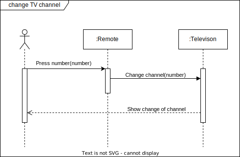
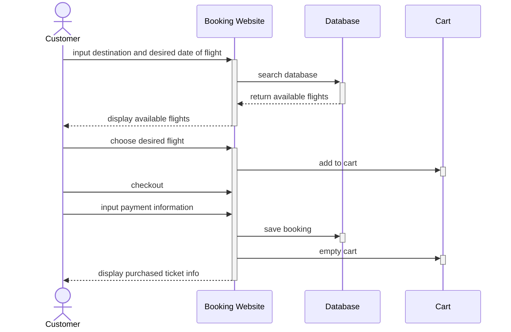

# Sequence Diagrams

Sequence diagrams are used to show a design team how objects in a program interact with each other to complete tasks.

Sequence diagrams can help you visualize the classes you will create in your software and determine the functions that will need to be written.

## Components of a sequence diagram

- **Boxes** are used to represent a role played by an object. The **role** is typically named after the class for the object.
- "Lifelines" which are **vertical dotted lines**, are used in the diagram to indicate an object as time goes by.
- **Solid line arrows** are used to show **messages** that are sent from one object to another, or a sender to a receiver. Receivers are at the pointed end of an arrow. A short description of the message is usually included above the arrow.
- **Dotted line arrows** are used to show a **return of data** and control back to initiating objects. A short description of the return of data or control is usually included above the arrow.
- **Small rectangles** along an object’s lifeline denote a method **activation**. You activate an object whenever an object sends, receives, or is waiting for a message.
- **actors** may also be included in sequence diagrams if they use or interact with objects. Actors are typically represented with stick figures.

Sequence diagrams are typically framed within a large box. Titles for the diagram are indicated in top, left corners.

## Example: Change TV channel

Below is an example of a sequence diagram for changing the channel of your television using a remote control

### Loop and alternative

As you design software, your sequence diagrams may get much more complicated. Loops and alternative processes can also be demonstrated in a sequence diagram.

An **alternative** process is a sequence of actions that will occur if a condition is true. An alternative sequence can be placed in a box and labelled "alt" for alternative in the top right corner.

*Let us build on the previous example to illustrate this. Imagine a scenario where the TV viewer is unsure what channel to go to and would like to surf channels until they pick one they like. This scenario can be illustrated under the previous sequence with the condition “[else].” This indicates that this scenario occurs only if all the other alternatives are false.*

*This scenario also contains a loop. This can be illustrated through adding a box labelled “loop.” Under the label, the conditional statement for the loop should be written. If that statement is true, then the system will go through the loop. In this example, the loop sequence should continually occur if the TV viewer is unhappy with the channel they are watching.*

## Example: Flight Booking

Create a UML sequence diagram that will show your clients how the system’s classes will interact when customers are buying their flight tickets on the booking website.

The system should allow the customer to search available flights from the database by inputting their desired location and departure/arrival date. The website will search the database and return the available flights to display.

Once the customer has chosen the flight, they will add the flight to their cart and checkout. They will also then input their payment information and once everything is complete, the website should confirm the flight, empty cart and lastly display a confirmation of the ticket for the flight.

